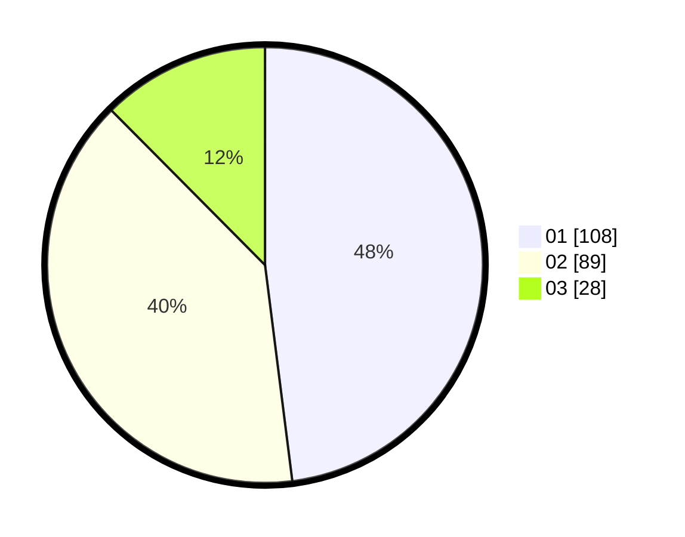

# Hasil

Hasil perolehan suara paslon dapat dilihat pada file paslon-01.txt, paslon-02.txt, dan paslon-03.txt.

Jika tidak ada, artinya data tersebut belum ada pada SIREKAP.

## Perolehan Suara

 * Paslon 01: **108**.
 * Paslon 02: **89**.
 * Paslon 03: **28**.

## Foto C Plano

https://sirekap-obj-formc.kpu.go.id/c94f/pemilu/ppwp/31/75/01/10/02/3175011002084-20240214-222321--1d20fd91-65f0-4456-96e7-5b7be51bc758.jpg

https://sirekap-obj-formc.kpu.go.id/c94f/pemilu/ppwp/31/75/01/10/02/3175011002084-20240214-214451--42747e73-09e3-4105-b549-2248d4e60da9.jpg

https://sirekap-obj-formc.kpu.go.id/c94f/pemilu/ppwp/31/75/01/10/02/3175011002084-20240214-214634--08c712d6-3319-435f-bc4e-11c5cb363f0e.jpg

## DATA PEMILIH TETAP

Jumlah pemilih dalam DPT: **278**.
 * L: **142**.
 * P: **136**.

## DATA PENGGUNA HAK PILIH

Jumlah pengguna hak pilih dalam DPT: **221**.
 * L: **112**.
 * P: **109**.

Jumlah pengguna hak pilih dalam DPTb: **5**.
 * L: **3**.
 * P: **2**.

Jumlah pengguna hak pilih dalam DPK: **0**.
 * L: **0**.
 * P: **0**.

Jumlah pengguna hak pilih: **226**.
 * L: **115**.
 * P: **111**.

## JUMLAH SUARA SAH DAN TIDAK SAH

JUMLAH SELURUH SUARA SAH: **225**.

JUMLAH SUARA TIDAK SAH: **1**.

JUMLAH SELURUH SUARA SAH DAN SUARA TIDAK SAH: **226**.
