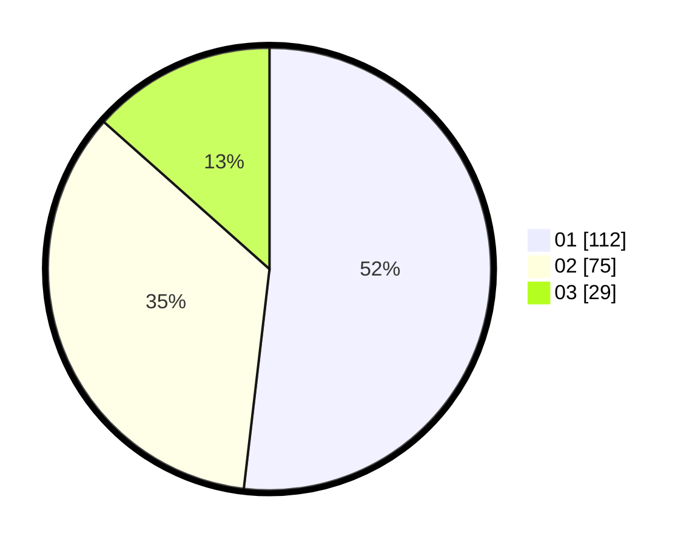

# Hasil

Hasil perolehan suara paslon dapat dilihat pada file paslon-01.txt, paslon-02.txt, dan paslon-03.txt.

Jika tidak ada, artinya data tersebut belum ada pada SIREKAP.

## Perolehan Suara

 * Paslon 01: **112**.
 * Paslon 02: **75**.
 * Paslon 03: **29**.

## Foto C Plano

https://sirekap-obj-formc.kpu.go.id/fb9b/pemilu/ppwp/31/75/01/10/02/3175011002088-20240217-004222--d4d35a36-2751-478b-8f7f-4c3d63e1842a.jpg

https://sirekap-obj-formc.kpu.go.id/fb9b/pemilu/ppwp/31/75/01/10/02/3175011002088-20240217-004223--a8888a52-6456-4f1a-ba01-94d932517800.jpg

https://sirekap-obj-formc.kpu.go.id/fb9b/pemilu/ppwp/31/75/01/10/02/3175011002088-20240217-004223--0b08ece5-2d1b-422a-94bb-95c103ffa51c.jpg

## DATA PEMILIH TETAP

Jumlah pemilih dalam DPT: **274**.
 * L: **132**.
 * P: **142**.

## DATA PENGGUNA HAK PILIH

Jumlah pengguna hak pilih dalam DPT: **212**.
 * L: **99**.
 * P: **113**.

Jumlah pengguna hak pilih dalam DPTb: **6**.
 * L: **3**.
 * P: **3**.

Jumlah pengguna hak pilih dalam DPK: **0**.
 * L: **0**.
 * P: **0**.

Jumlah pengguna hak pilih: **218**.
 * L: **102**.
 * P: **116**.

## JUMLAH SUARA SAH DAN TIDAK SAH

JUMLAH SELURUH SUARA SAH: **216**.

JUMLAH SUARA TIDAK SAH: **2**.

JUMLAH SELURUH SUARA SAH DAN SUARA TIDAK SAH: **218**.
