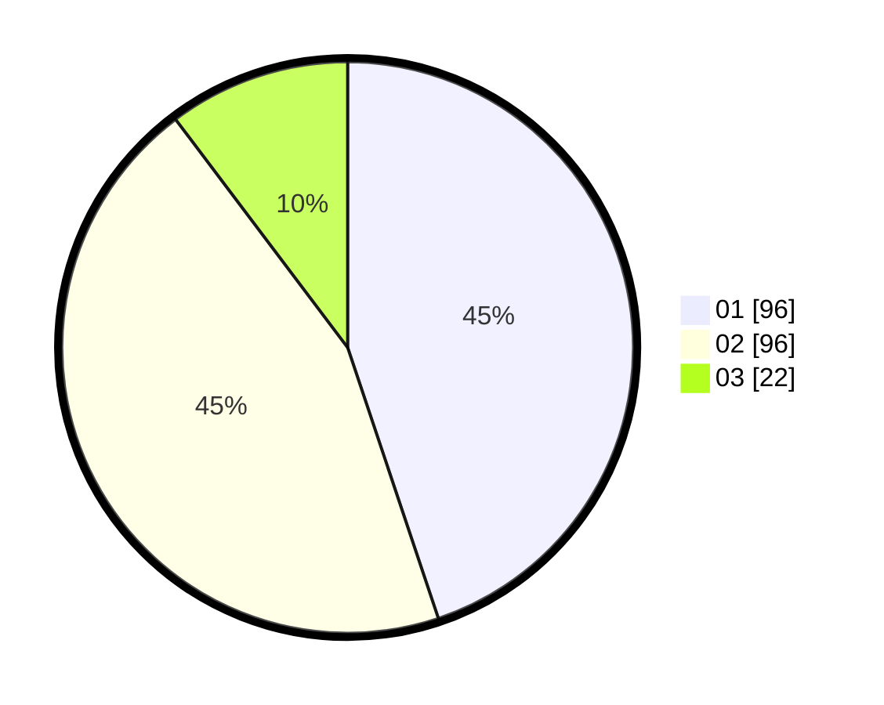

# Hasil

Hasil perolehan suara paslon dapat dilihat pada file paslon-01.txt, paslon-02.txt, dan paslon-03.txt.

Jika tidak ada, artinya data tersebut belum ada pada SIREKAP.

## Perolehan Suara

 * Paslon 01: **96**.
 * Paslon 02: **96**.
 * Paslon 03: **22**.

## Foto C Plano

https://sirekap-obj-formc.kpu.go.id/abf6/pemilu/ppwp/31/75/01/10/02/3175011002089-20240214-185006--45c44e12-a88f-4733-ab6f-6790d5e62f7e.jpg

https://sirekap-obj-formc.kpu.go.id/abf6/pemilu/ppwp/31/75/01/10/02/3175011002089-20240216-131639--a25056bb-ae99-44e7-b421-5057fea61e8e.jpg

https://sirekap-obj-formc.kpu.go.id/abf6/pemilu/ppwp/31/75/01/10/02/3175011002089-20240216-131102--e71981ac-6041-4866-bc28-e4c63e22ac93.jpg
