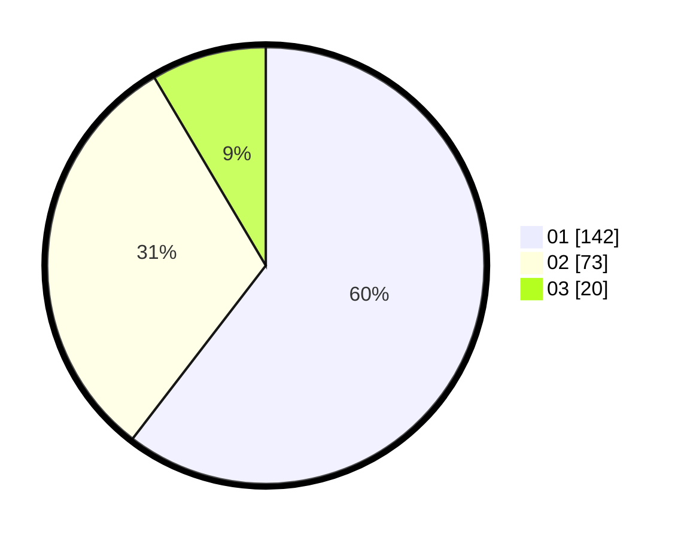

# Hasil

Hasil perolehan suara paslon dapat dilihat pada file paslon-01.txt, paslon-02.txt, dan paslon-03.txt.

Jika tidak ada, artinya data tersebut belum ada pada SIREKAP.

## Perolehan Suara

 * Paslon 01: **142**.
 * Paslon 02: **73**.
 * Paslon 03: **20**.

## Foto C Plano

https://sirekap-obj-formc.kpu.go.id/1829/pemilu/ppwp/31/75/01/10/02/3175011002090-20240214-204853--7c61b5bb-221d-46f6-be14-0b88165f6401.jpg

https://sirekap-obj-formc.kpu.go.id/1829/pemilu/ppwp/31/75/01/10/02/3175011002090-20240214-231524--6a14cbb0-3074-43f9-a27c-fa05d3eb8862.jpg

https://sirekap-obj-formc.kpu.go.id/1829/pemilu/ppwp/31/75/01/10/02/3175011002090-20240214-205003--a74f8e42-e326-4784-ab8a-7547ee13fcb4.jpg

## DATA PEMILIH TETAP

Jumlah pemilih dalam DPT: **282**.
 * L: **118**.
 * P: **164**.

## DATA PENGGUNA HAK PILIH

Jumlah pengguna hak pilih dalam DPT: **229**.
 * L: **102**.
 * P: **127**.

Jumlah pengguna hak pilih dalam DPTb: **9**.
 * L: **4**.
 * P: **5**.

Jumlah pengguna hak pilih dalam DPK: **0**.
 * L: **0**.
 * P: **0**.

Jumlah pengguna hak pilih: **238**.
 * L: **106**.
 * P: **132**.

## JUMLAH SUARA SAH DAN TIDAK SAH

JUMLAH SELURUH SUARA SAH: **235**.

JUMLAH SUARA TIDAK SAH: **3**.

JUMLAH SELURUH SUARA SAH DAN SUARA TIDAK SAH: **238**.
