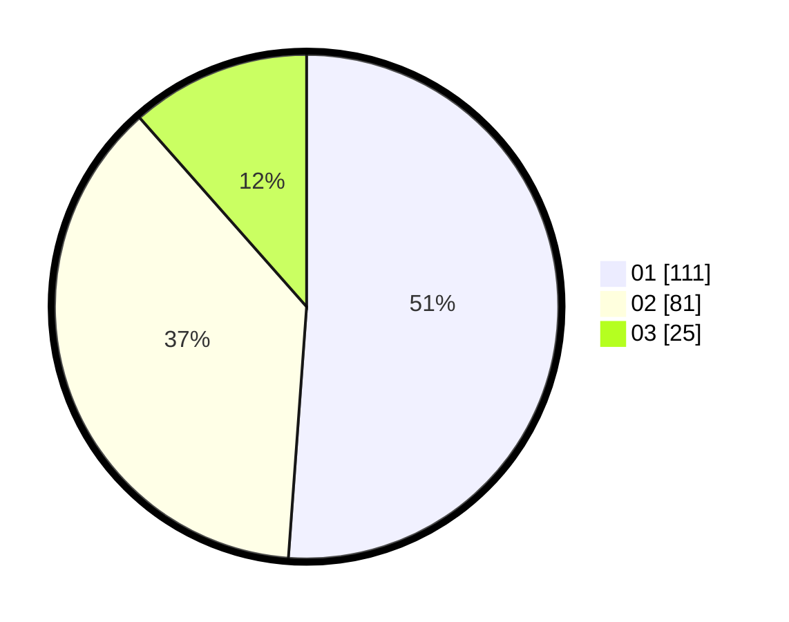

# Hasil

Hasil perolehan suara paslon dapat dilihat pada file paslon-01.txt, paslon-02.txt, dan paslon-03.txt.

Jika tidak ada, artinya data tersebut belum ada pada SIREKAP.

## Perolehan Suara

 * Paslon 01: **111**.
 * Paslon 02: **81**.
 * Paslon 03: **25**.

## Foto C Plano

https://sirekap-obj-formc.kpu.go.id/1e43/pemilu/ppwp/31/75/01/10/02/3175011002091-20240214-192444--e57c350c-ae51-48ec-b9b2-a38cd7407226.jpg

https://sirekap-obj-formc.kpu.go.id/1e43/pemilu/ppwp/31/75/01/10/02/3175011002091-20240217-113141--6f429f72-5c33-4296-972e-23981b9facc8.jpg

https://sirekap-obj-formc.kpu.go.id/1e43/pemilu/ppwp/31/75/01/10/02/3175011002091-20240214-211339--b5f9eee3-c30d-4a8a-b38e-98bb75e2af36.jpg
