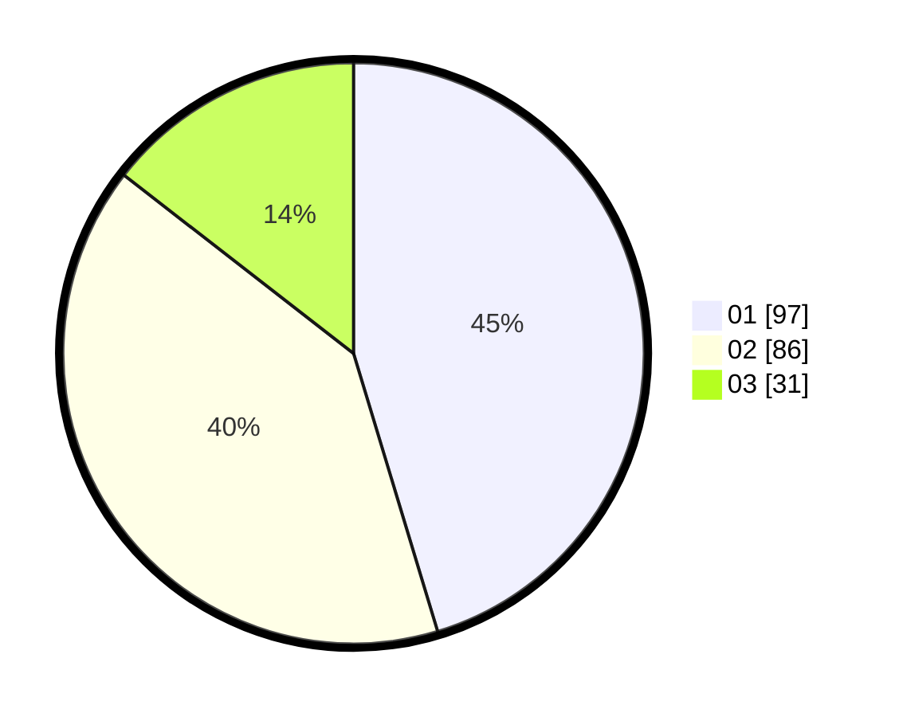

# Hasil

Hasil perolehan suara paslon dapat dilihat pada file paslon-01.txt, paslon-02.txt, dan paslon-03.txt.

Jika tidak ada, artinya data tersebut belum ada pada SIREKAP.

## Perolehan Suara

 * Paslon 01: **97**.
 * Paslon 02: **86**.
 * Paslon 03: **31**.

## Foto C Plano

https://sirekap-obj-formc.kpu.go.id/3c59/pemilu/ppwp/31/75/01/10/03/3175011003003-20240214-200659--9598e2df-8b44-48cc-a585-7766e5bf25fe.jpg

https://sirekap-obj-formc.kpu.go.id/3c59/pemilu/ppwp/31/75/01/10/03/3175011003003-20240214-200739--f8c5d3eb-0c08-4405-821a-37d8e3109b25.jpg

https://sirekap-obj-formc.kpu.go.id/3c59/pemilu/ppwp/31/75/01/10/03/3175011003003-20240214-200859--a23186d0-a319-49cd-9e90-ec3855a60a14.jpg

## DATA PEMILIH TETAP

Jumlah pemilih dalam DPT: **270**.
 * L: **138**.
 * P: **132**.

## DATA PENGGUNA HAK PILIH

Jumlah pengguna hak pilih dalam DPT: **216**.
 * L: **107**.
 * P: **109**.

Jumlah pengguna hak pilih dalam DPTb: **0**.
 * L: **0**.
 * P: **0**.

Jumlah pengguna hak pilih dalam DPK: **3**.
 * L: **1**.
 * P: **2**.

Jumlah pengguna hak pilih: **219**.
 * L: **108**.
 * P: **111**.

## JUMLAH SUARA SAH DAN TIDAK SAH

JUMLAH SELURUH SUARA SAH: **214**.

JUMLAH SUARA TIDAK SAH: **5**.

JUMLAH SELURUH SUARA SAH DAN SUARA TIDAK SAH: **219**.
