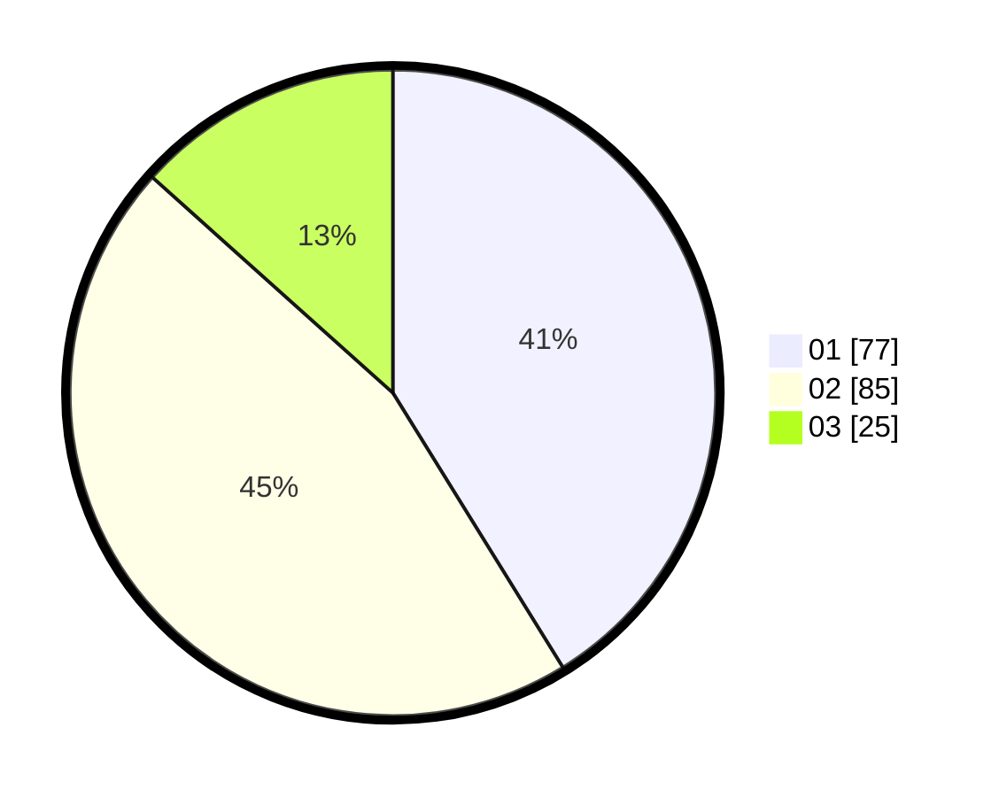

# Hasil

Hasil perolehan suara paslon dapat dilihat pada file paslon-01.txt, paslon-02.txt, dan paslon-03.txt.

Jika tidak ada, artinya data tersebut belum ada pada SIREKAP.

## Perolehan Suara

 * Paslon 01: **77**.
 * Paslon 02: **85**.
 * Paslon 03: **25**.

## Foto C Plano

https://sirekap-obj-formc.kpu.go.id/f187/pemilu/ppwp/31/75/01/10/03/3175011003005-20240216-144737--75f9442a-c7ae-4cf0-866f-48ad3ab4ec40.jpg

https://sirekap-obj-formc.kpu.go.id/f187/pemilu/ppwp/31/75/01/10/03/3175011003005-20240216-144739--3208c042-9157-4c0b-8988-8c1470d56005.jpg

https://sirekap-obj-formc.kpu.go.id/f187/pemilu/ppwp/31/75/01/10/03/3175011003005-20240216-144738--c5c38ac5-da62-4d74-b8d6-23e1107ef875.jpg

## DATA PEMILIH TETAP

Jumlah pemilih dalam DPT: **188**.
 * L: **88**.
 * P: **100**.

## DATA PENGGUNA HAK PILIH

Jumlah pengguna hak pilih dalam DPT: **188**.
 * L: **88**.
 * P: **100**.

Jumlah pengguna hak pilih dalam DPTb: **1**.
 * L: **1**.
 * P: **0**.

Jumlah pengguna hak pilih dalam DPK: **0**.
 * L: **0**.
 * P: **0**.

Jumlah pengguna hak pilih: **189**.
 * L: **89**.
 * P: **100**.

## JUMLAH SUARA SAH DAN TIDAK SAH

JUMLAH SELURUH SUARA SAH: **187**.

JUMLAH SUARA TIDAK SAH: **2**.

JUMLAH SELURUH SUARA SAH DAN SUARA TIDAK SAH: **189**.
