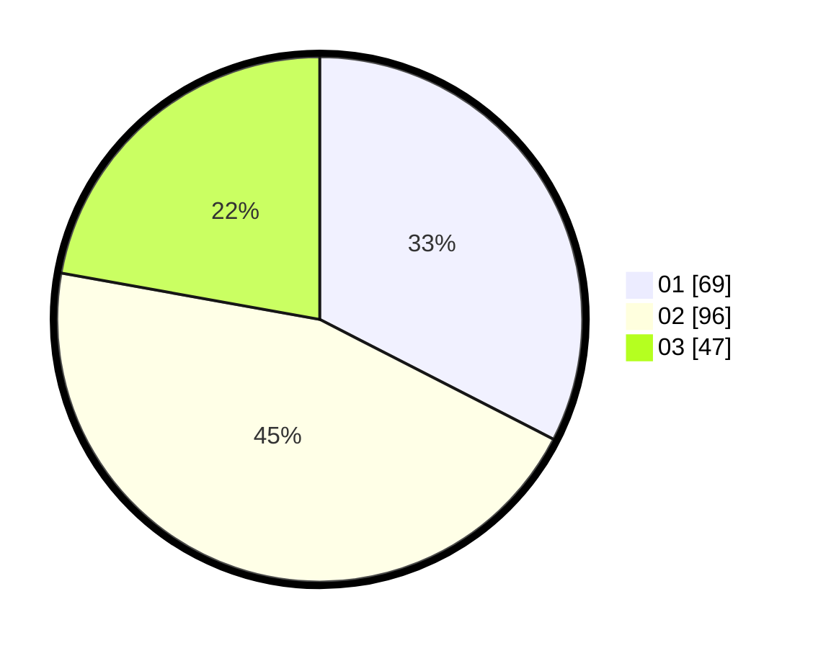

# Hasil

Hasil perolehan suara paslon dapat dilihat pada file paslon-01.txt, paslon-02.txt, dan paslon-03.txt.

Jika tidak ada, artinya data tersebut belum ada pada SIREKAP.

## Perolehan Suara

 * Paslon 01: **69**.
 * Paslon 02: **96**.
 * Paslon 03: **47**.

## Foto C Plano

https://sirekap-obj-formc.kpu.go.id/7d5b/pemilu/ppwp/31/75/01/10/03/3175011003009-20240214-204957--50fe00fd-ac63-4408-9f95-cec04166aaf7.jpg

https://sirekap-obj-formc.kpu.go.id/7d5b/pemilu/ppwp/31/75/01/10/03/3175011003009-20240214-200136--0e6401b3-5c63-4073-b558-40ab7cd43ad3.jpg

https://sirekap-obj-formc.kpu.go.id/7d5b/pemilu/ppwp/31/75/01/10/03/3175011003009-20240214-210251--09c478db-163f-4115-8758-54c2f1f4f76a.jpg
