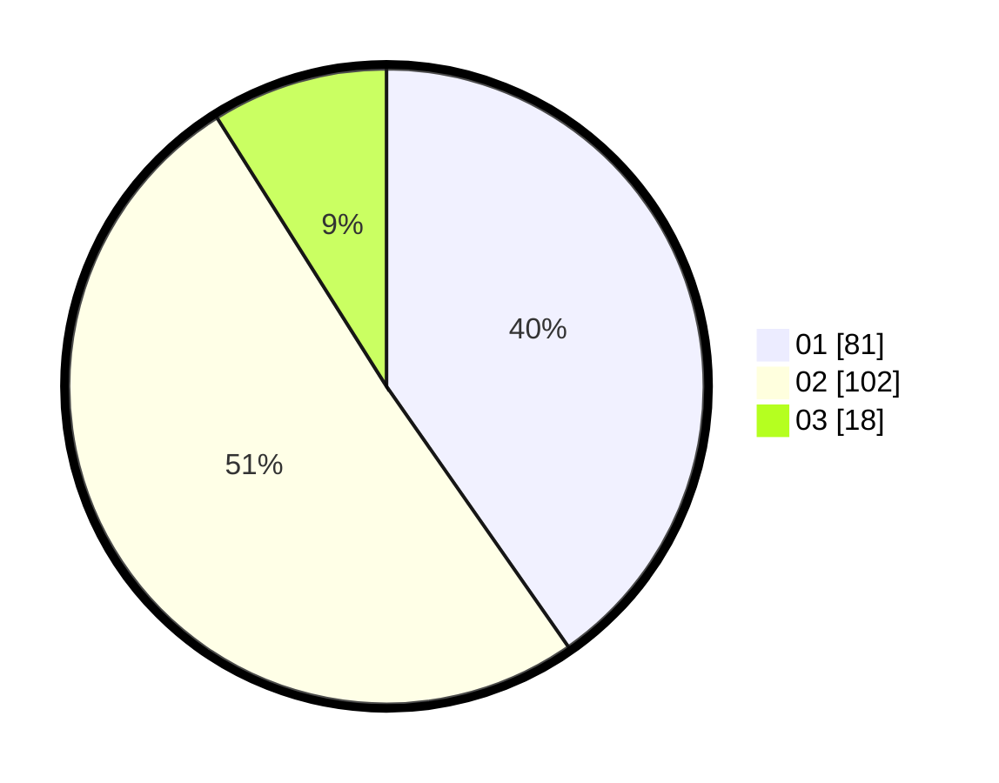

# Hasil

Hasil perolehan suara paslon dapat dilihat pada file paslon-01.txt, paslon-02.txt, dan paslon-03.txt.

Jika tidak ada, artinya data tersebut belum ada pada SIREKAP.

## Perolehan Suara

 * Paslon 01: **81**.
 * Paslon 02: **102**.
 * Paslon 03: **18**.

## Foto C Plano

https://sirekap-obj-formc.kpu.go.id/4668/pemilu/ppwp/31/75/01/10/03/3175011003010-20240214-230040--a5e55024-d209-49c3-a690-bbc2875c781b.jpg

https://sirekap-obj-formc.kpu.go.id/4668/pemilu/ppwp/31/75/01/10/03/3175011003010-20240214-230109--b0ab81ba-af93-4d71-99cf-ef3c7b8e4a55.jpg

https://sirekap-obj-formc.kpu.go.id/4668/pemilu/ppwp/31/75/01/10/03/3175011003010-20240214-230123--216056f9-921c-4a87-9aab-e5c7f7819223.jpg

## DATA PEMILIH TETAP

Jumlah pemilih dalam DPT: **272**.
 * L: **131**.
 * P: **141**.

## DATA PENGGUNA HAK PILIH

Jumlah pengguna hak pilih dalam DPT: **196**.
 * L: **95**.
 * P: **101**.

Jumlah pengguna hak pilih dalam DPTb: **1**.
 * L: **1**.
 * P: **0**.

Jumlah pengguna hak pilih dalam DPK: **7**.
 * L: **3**.
 * P: **4**.

Jumlah pengguna hak pilih: **204**.
 * L: **99**.
 * P: **105**.

## JUMLAH SUARA SAH DAN TIDAK SAH

JUMLAH SELURUH SUARA SAH: **201**.

JUMLAH SUARA TIDAK SAH: **3**.

JUMLAH SELURUH SUARA SAH DAN SUARA TIDAK SAH: **204**.
