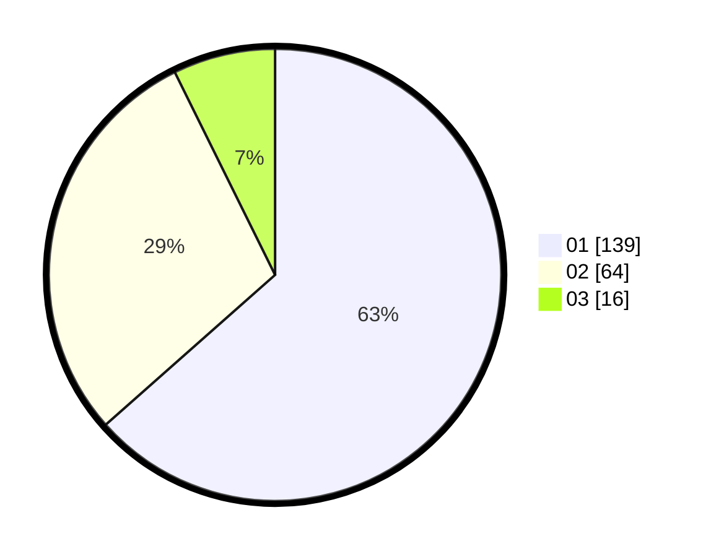

# Hasil

Hasil perolehan suara paslon dapat dilihat pada file paslon-01.txt, paslon-02.txt, dan paslon-03.txt.

Jika tidak ada, artinya data tersebut belum ada pada SIREKAP.

## Perolehan Suara

 * Paslon 01: **139**.
 * Paslon 02: **64**.
 * Paslon 03: **16**.

## Foto C Plano

https://sirekap-obj-formc.kpu.go.id/7e74/pemilu/ppwp/31/75/01/10/03/3175011003011-20240214-215811--c41fddaf-ce3c-4c64-8cf0-378ff34bda66.jpg

https://sirekap-obj-formc.kpu.go.id/7e74/pemilu/ppwp/31/75/01/10/03/3175011003011-20240214-215921--d6239918-b334-480e-9f9c-fd3b5c630708.jpg

https://sirekap-obj-formc.kpu.go.id/7e74/pemilu/ppwp/31/75/01/10/03/3175011003011-20240214-220010--a70d8960-53a2-4037-a1f3-5ee38dfdef03.jpg
