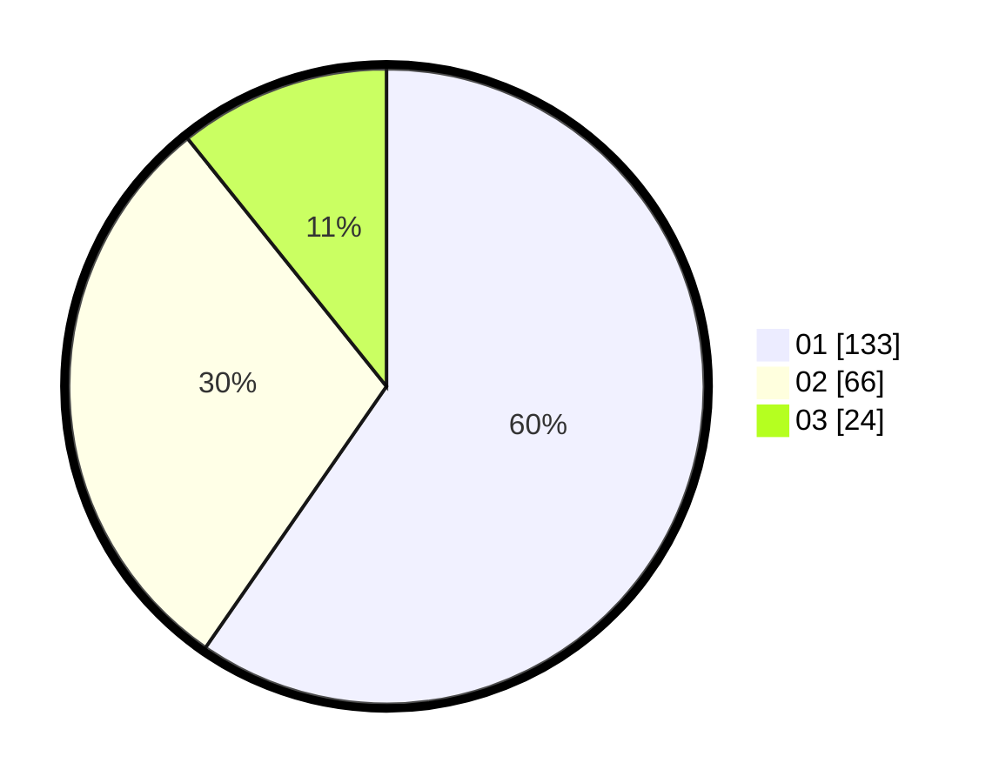

# Hasil

Hasil perolehan suara paslon dapat dilihat pada file paslon-01.txt, paslon-02.txt, dan paslon-03.txt.

Jika tidak ada, artinya data tersebut belum ada pada SIREKAP.

## Perolehan Suara

 * Paslon 01: **133**.
 * Paslon 02: **66**.
 * Paslon 03: **24**.

## Foto C Plano

https://sirekap-obj-formc.kpu.go.id/69a6/pemilu/ppwp/31/75/01/10/03/3175011003015-20240214-204618--3d113b15-5bb7-4569-818b-1de32bb8eab1.jpg

https://sirekap-obj-formc.kpu.go.id/69a6/pemilu/ppwp/31/75/01/10/03/3175011003015-20240214-204701--b1ddfdfd-9ddd-430d-b58e-77d02046374a.jpg

https://sirekap-obj-formc.kpu.go.id/69a6/pemilu/ppwp/31/75/01/10/03/3175011003015-20240214-204749--ed53510a-4371-478e-a6e3-82ead3de8f0d.jpg

## DATA PEMILIH TETAP

Jumlah pemilih dalam DPT: **219**.
 * L: **105**.
 * P: **114**.

## DATA PENGGUNA HAK PILIH

Jumlah pengguna hak pilih dalam DPT: **219**.
 * L: **105**.
 * P: **114**.

Jumlah pengguna hak pilih dalam DPTb: **4**.
 * L: **2**.
 * P: **2**.

Jumlah pengguna hak pilih dalam DPK: **0**.
 * L: **0**.
 * P: **0**.

Jumlah pengguna hak pilih: **223**.
 * L: **107**.
 * P: **116**.

## JUMLAH SUARA SAH DAN TIDAK SAH

JUMLAH SELURUH SUARA SAH: **223**.

JUMLAH SUARA TIDAK SAH: **3**.

JUMLAH SELURUH SUARA SAH DAN SUARA TIDAK SAH: **226**.
