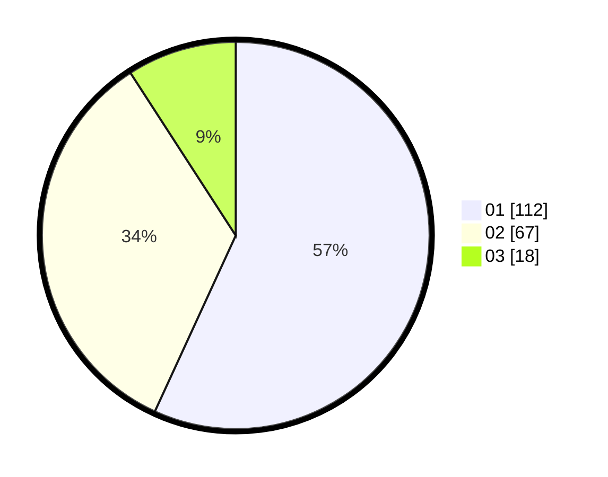

# Hasil

Hasil perolehan suara paslon dapat dilihat pada file paslon-01.txt, paslon-02.txt, dan paslon-03.txt.

Jika tidak ada, artinya data tersebut belum ada pada SIREKAP.

## Perolehan Suara

 * Paslon 01: **112**.
 * Paslon 02: **67**.
 * Paslon 03: **18**.

## Foto C Plano

https://sirekap-obj-formc.kpu.go.id/2a8b/pemilu/ppwp/31/75/01/10/03/3175011003020-20240214-155112--c8aba160-2746-40d1-b4d8-e56c6fde04da.jpg

https://sirekap-obj-formc.kpu.go.id/2a8b/pemilu/ppwp/31/75/01/10/03/3175011003020-20240214-212326--d72c0be0-b5fd-49a7-9da4-bc3e52ac83cc.jpg

https://sirekap-obj-formc.kpu.go.id/2a8b/pemilu/ppwp/31/75/01/10/03/3175011003020-20240214-212427--8c13b5be-bda5-40a4-a357-a22fd89ad3a3.jpg

## DATA PEMILIH TETAP

Jumlah pemilih dalam DPT: **272**.
 * L: **135**.
 * P: **137**.

## DATA PENGGUNA HAK PILIH

Jumlah pengguna hak pilih dalam DPT: **199**.
 * L: **93**.
 * P: **106**.

Jumlah pengguna hak pilih dalam DPTb: **0**.
 * L: **0**.
 * P: **0**.

Jumlah pengguna hak pilih dalam DPK: **2**.
 * L: **0**.
 * P: **2**.

Jumlah pengguna hak pilih: **201**.
 * L: **93**.
 * P: **108**.

## JUMLAH SUARA SAH DAN TIDAK SAH

JUMLAH SELURUH SUARA SAH: **197**.

JUMLAH SUARA TIDAK SAH: **4**.

JUMLAH SELURUH SUARA SAH DAN SUARA TIDAK SAH: **201**.
