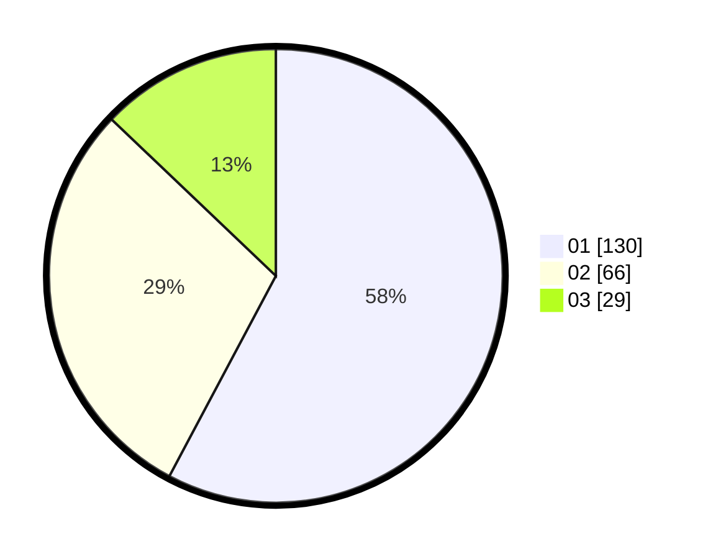

# Hasil

Hasil perolehan suara paslon dapat dilihat pada file paslon-01.txt, paslon-02.txt, dan paslon-03.txt.

Jika tidak ada, artinya data tersebut belum ada pada SIREKAP.

## Perolehan Suara

 * Paslon 01: **130**.
 * Paslon 02: **66**.
 * Paslon 03: **29**.

## Foto C Plano

https://sirekap-obj-formc.kpu.go.id/a4df/pemilu/ppwp/31/75/01/10/03/3175011003025-20240214-190758--ef588d88-3a97-4043-8cc8-b1eff9c83593.jpg

https://sirekap-obj-formc.kpu.go.id/a4df/pemilu/ppwp/31/75/01/10/03/3175011003025-20240214-190801--08523422-ce38-495b-b386-e238c45e7f4e.jpg

https://sirekap-obj-formc.kpu.go.id/a4df/pemilu/ppwp/31/75/01/10/03/3175011003025-20240214-190804--fd39dab9-6035-4a2a-ad05-f04fc450049e.jpg
