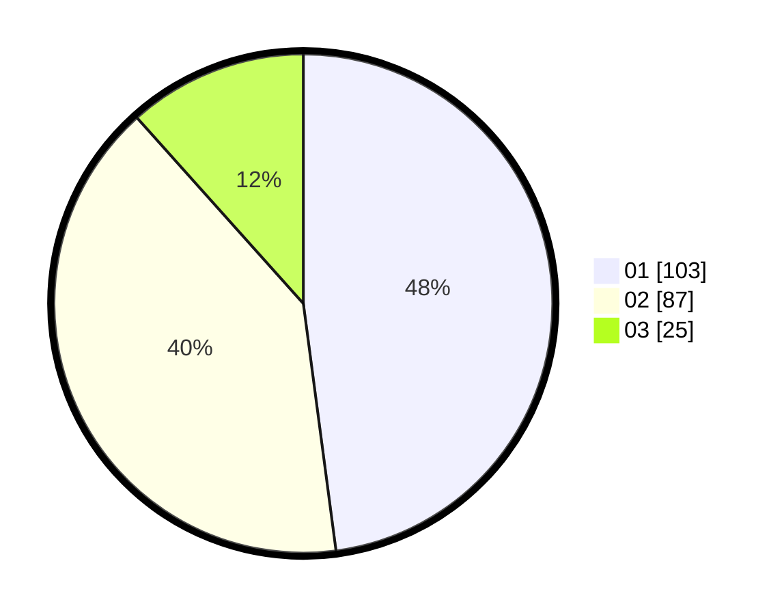

# Hasil

Hasil perolehan suara paslon dapat dilihat pada file paslon-01.txt, paslon-02.txt, dan paslon-03.txt.

Jika tidak ada, artinya data tersebut belum ada pada SIREKAP.

## Perolehan Suara

 * Paslon 01: **103**.
 * Paslon 02: **87**.
 * Paslon 03: **25**.

## Foto C Plano

https://sirekap-obj-formc.kpu.go.id/fbc4/pemilu/ppwp/31/75/01/10/03/3175011003037-20240214-214615--f163affb-a0b6-420e-b980-c21d300f4608.jpg

https://sirekap-obj-formc.kpu.go.id/fbc4/pemilu/ppwp/31/75/01/10/03/3175011003037-20240214-214705--cd978874-4d53-4d78-9137-2429892c2354.jpg

https://sirekap-obj-formc.kpu.go.id/fbc4/pemilu/ppwp/31/75/01/10/03/3175011003037-20240214-214752--9e3bd801-9ae3-4aee-b237-7a333fc278d9.jpg
