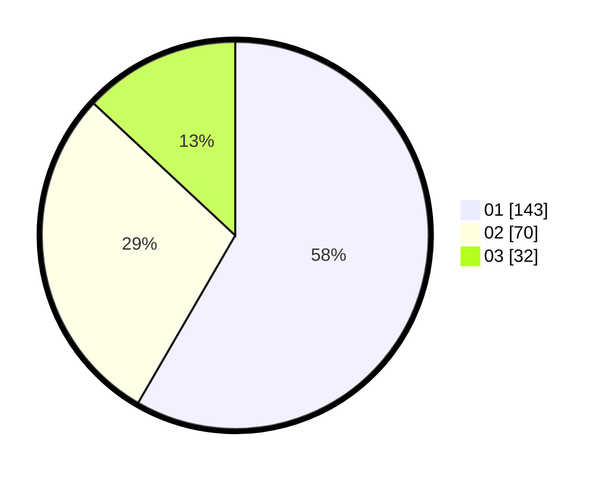

# Hasil

Hasil perolehan suara paslon dapat dilihat pada file paslon-01.txt, paslon-02.txt, dan paslon-03.txt.

Jika tidak ada, artinya data tersebut belum ada pada SIREKAP.

## Perolehan Suara

 * Paslon 01: **143**.
 * Paslon 02: **70**.
 * Paslon 03: **32**.

## Foto C Plano

https://sirekap-obj-formc.kpu.go.id/6150/pemilu/ppwp/31/75/01/10/03/3175011003042-20240214-221620--9ea3a583-2935-4d5c-a6be-280acc7b11d2.jpg

https://sirekap-obj-formc.kpu.go.id/6150/pemilu/ppwp/31/75/01/10/03/3175011003042-20240214-221826--38d58f77-0ed9-4c76-a047-f7427819c7a1.jpg

https://sirekap-obj-formc.kpu.go.id/6150/pemilu/ppwp/31/75/01/10/03/3175011003042-20240214-221936--278169f0-c491-4e6b-9212-85c2e9fe8866.jpg
