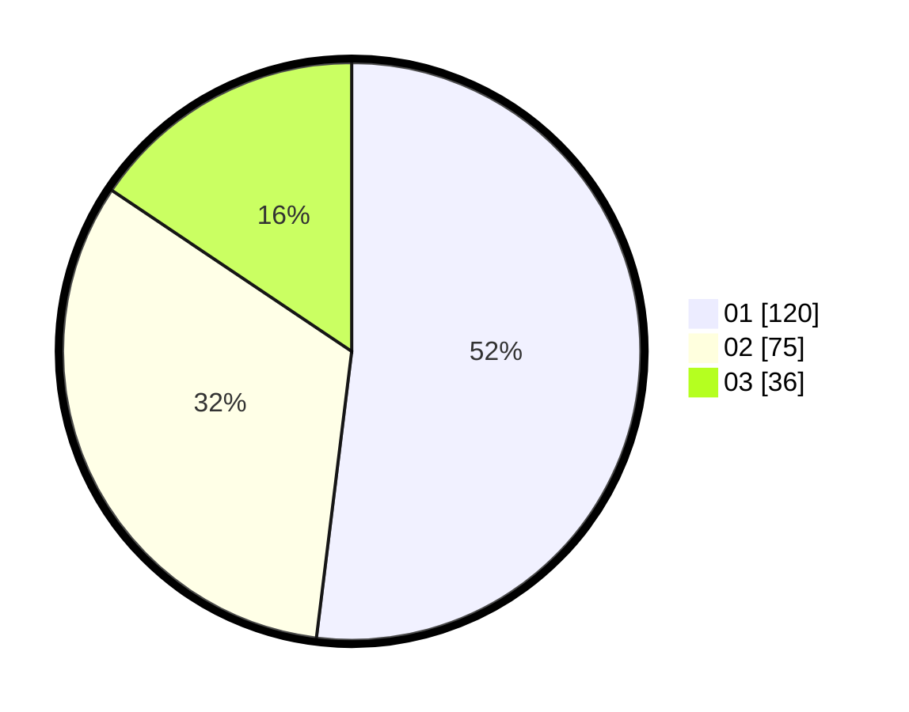

# Hasil

Hasil perolehan suara paslon dapat dilihat pada file paslon-01.txt, paslon-02.txt, dan paslon-03.txt.

Jika tidak ada, artinya data tersebut belum ada pada SIREKAP.

## Perolehan Suara

 * Paslon 01: **120**.
 * Paslon 02: **75**.
 * Paslon 03: **36**.

## Foto C Plano

https://sirekap-obj-formc.kpu.go.id/ef70/pemilu/ppwp/31/75/01/10/03/3175011003043-20240214-204408--8f0405a2-4095-4263-9cbb-e3082c9539fd.jpg

https://sirekap-obj-formc.kpu.go.id/ef70/pemilu/ppwp/31/75/01/10/03/3175011003043-20240214-220901--b292efdf-f529-41b9-94c9-96d06a6f621f.jpg

https://sirekap-obj-formc.kpu.go.id/ef70/pemilu/ppwp/31/75/01/10/03/3175011003043-20240214-204615--fcfdbbea-71ba-48b0-8ad5-46a33267093e.jpg
