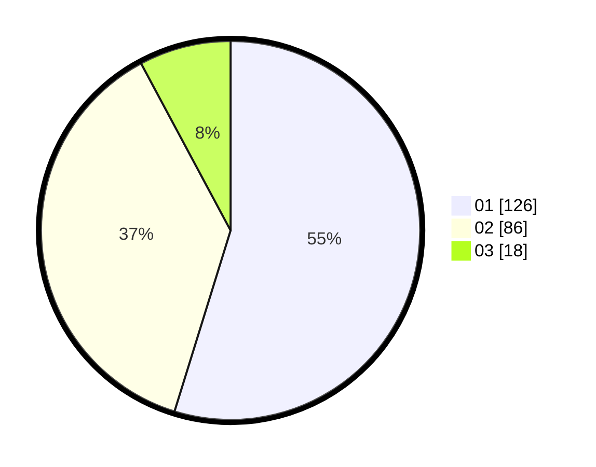

# Hasil

Hasil perolehan suara paslon dapat dilihat pada file paslon-01.txt, paslon-02.txt, dan paslon-03.txt.

Jika tidak ada, artinya data tersebut belum ada pada SIREKAP.

## Perolehan Suara

 * Paslon 01: **126**.
 * Paslon 02: **86**.
 * Paslon 03: **18**.

## Foto C Plano

https://sirekap-obj-formc.kpu.go.id/306a/pemilu/ppwp/31/75/01/10/03/3175011003044-20240214-193138--0a2a0f1b-e634-4b0f-b967-8008c9e576a2.jpg

https://sirekap-obj-formc.kpu.go.id/306a/pemilu/ppwp/31/75/01/10/03/3175011003044-20240214-195805--5f8e486c-8cb7-4574-a08e-88df4dbae792.jpg

https://sirekap-obj-formc.kpu.go.id/306a/pemilu/ppwp/31/75/01/10/03/3175011003044-20240214-185751--463c3f86-35ac-4090-aa08-27e2dddef3f2.jpg

## DATA PEMILIH TETAP

Jumlah pemilih dalam DPT: **289**.
 * L: **138**.
 * P: **151**.

## DATA PENGGUNA HAK PILIH

Jumlah pengguna hak pilih dalam DPT: **234**.
 * L: **104**.
 * P: **130**.

Jumlah pengguna hak pilih dalam DPTb: **2**.
 * L: **0**.
 * P: **2**.

Jumlah pengguna hak pilih dalam DPK: **0**.
 * L: **0**.
 * P: **0**.

Jumlah pengguna hak pilih: **236**.
 * L: **104**.
 * P: **132**.

## JUMLAH SUARA SAH DAN TIDAK SAH

JUMLAH SELURUH SUARA SAH: **230**.

JUMLAH SUARA TIDAK SAH: **6**.

JUMLAH SELURUH SUARA SAH DAN SUARA TIDAK SAH: **236**.
