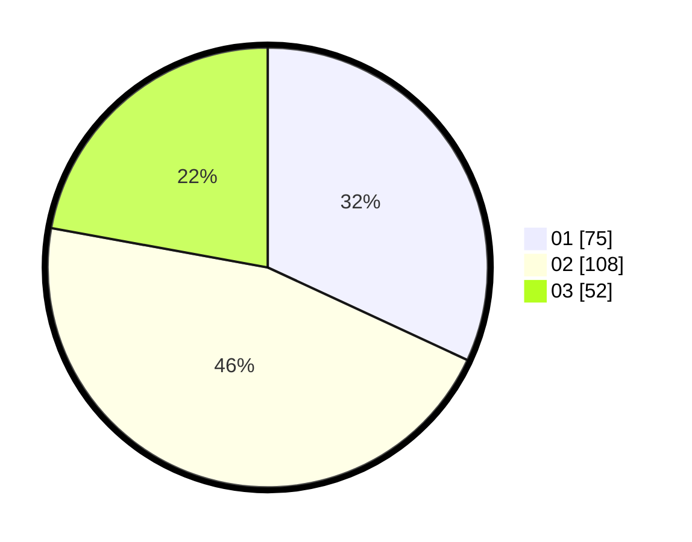

# Hasil

Hasil perolehan suara paslon dapat dilihat pada file paslon-01.txt, paslon-02.txt, dan paslon-03.txt.

Jika tidak ada, artinya data tersebut belum ada pada SIREKAP.

## Perolehan Suara

 * Paslon 01: **75**.
 * Paslon 02: **108**.
 * Paslon 03: **52**.

## Foto C Plano

https://sirekap-obj-formc.kpu.go.id/9bde/pemilu/ppwp/31/75/01/10/03/3175011003047-20240214-162225--3dbfc04d-8355-49de-a2f6-ead2b899c490.jpg

https://sirekap-obj-formc.kpu.go.id/9bde/pemilu/ppwp/31/75/01/10/03/3175011003047-20240214-155518--50934ad3-3421-490b-a86a-5b76c9e03e8b.jpg

https://sirekap-obj-formc.kpu.go.id/9bde/pemilu/ppwp/31/75/01/10/03/3175011003047-20240214-155851--a64983c9-d09d-419d-aacf-6d4b95156a56.jpg
