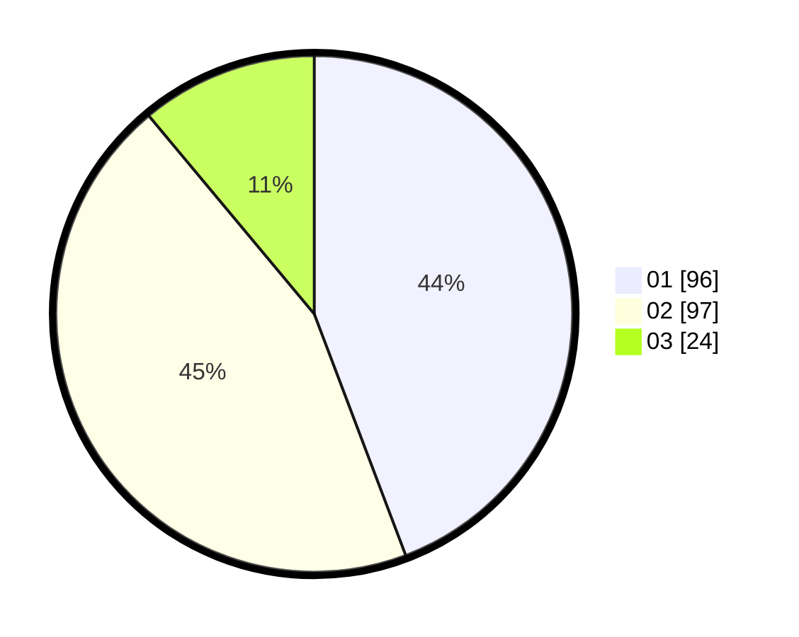

# Hasil

Hasil perolehan suara paslon dapat dilihat pada file paslon-01.txt, paslon-02.txt, dan paslon-03.txt.

Jika tidak ada, artinya data tersebut belum ada pada SIREKAP.

## Perolehan Suara

 * Paslon 01: **96**.
 * Paslon 02: **97**.
 * Paslon 03: **24**.

## Foto C Plano

https://sirekap-obj-formc.kpu.go.id/b132/pemilu/ppwp/31/75/01/10/03/3175011003049-20240214-224445--2a59dd33-f0d0-457e-a176-2ae4fa3ec7f8.jpg

https://sirekap-obj-formc.kpu.go.id/b132/pemilu/ppwp/31/75/01/10/03/3175011003049-20240214-224219--67533e78-a62b-4682-9aad-dd4e436dfdb1.jpg

https://sirekap-obj-formc.kpu.go.id/b132/pemilu/ppwp/31/75/01/10/03/3175011003049-20240214-224342--ffe373df-ac52-4e42-9f06-c8598dec47f0.jpg
