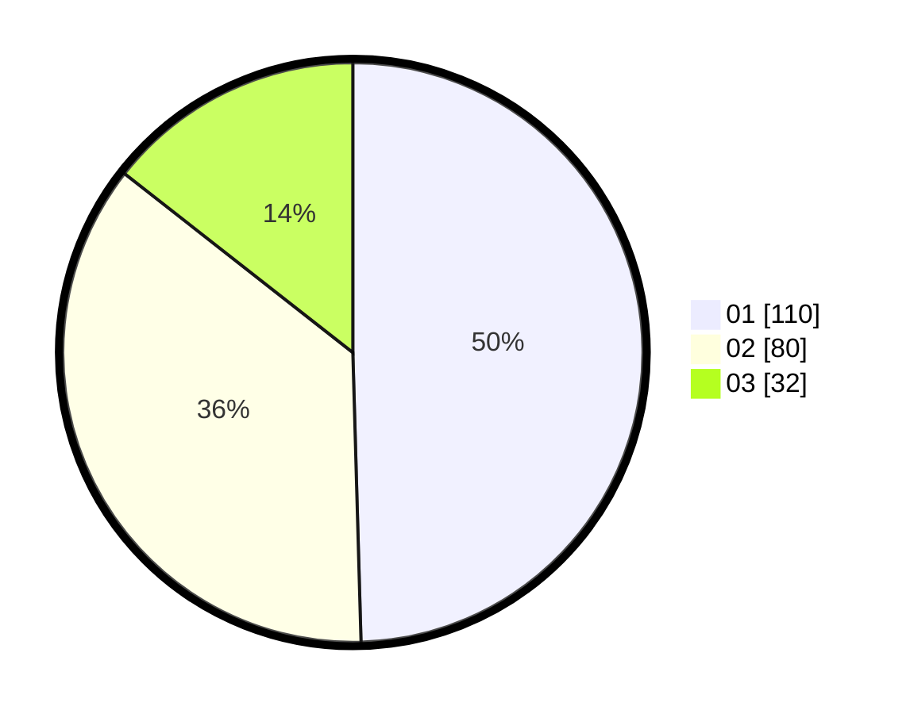

# Hasil

Hasil perolehan suara paslon dapat dilihat pada file paslon-01.txt, paslon-02.txt, dan paslon-03.txt.

Jika tidak ada, artinya data tersebut belum ada pada SIREKAP.

## Perolehan Suara

 * Paslon 01: **110**.
 * Paslon 02: **80**.
 * Paslon 03: **32**.

## Foto C Plano

https://sirekap-obj-formc.kpu.go.id/7312/pemilu/ppwp/31/75/01/10/03/3175011003050-20240214-193455--75675dfc-bc0b-4096-b799-c36a84483a82.jpg

https://sirekap-obj-formc.kpu.go.id/7312/pemilu/ppwp/31/75/01/10/03/3175011003050-20240214-193110--e8890490-3a3d-4456-b486-28064cd78562.jpg

https://sirekap-obj-formc.kpu.go.id/7312/pemilu/ppwp/31/75/01/10/03/3175011003050-20240214-193648--0acc874c-231b-4463-9173-0b536a13d3d6.jpg
