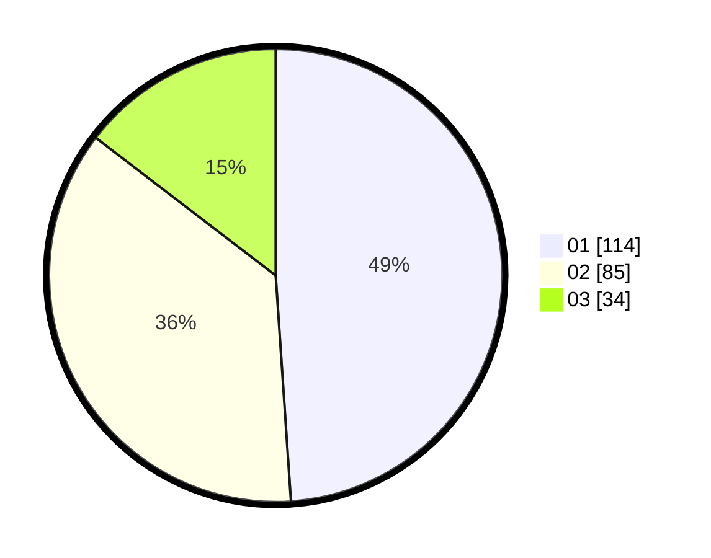

# Hasil

Hasil perolehan suara paslon dapat dilihat pada file paslon-01.txt, paslon-02.txt, dan paslon-03.txt.

Jika tidak ada, artinya data tersebut belum ada pada SIREKAP.

## Perolehan Suara

 * Paslon 01: **114**.
 * Paslon 02: **85**.
 * Paslon 03: **34**.

## Foto C Plano

https://sirekap-obj-formc.kpu.go.id/072b/pemilu/ppwp/31/75/01/10/03/3175011003053-20240214-224042--be8e86f4-38e8-4e44-bec5-73e00cb53454.jpg

https://sirekap-obj-formc.kpu.go.id/072b/pemilu/ppwp/31/75/01/10/03/3175011003053-20240214-202801--7c77852b-ff0e-4f06-804f-e390f5c7b289.jpg

https://sirekap-obj-formc.kpu.go.id/072b/pemilu/ppwp/31/75/01/10/03/3175011003053-20240214-214222--32f512ee-6b03-4ddd-883f-16c7df91f357.jpg
