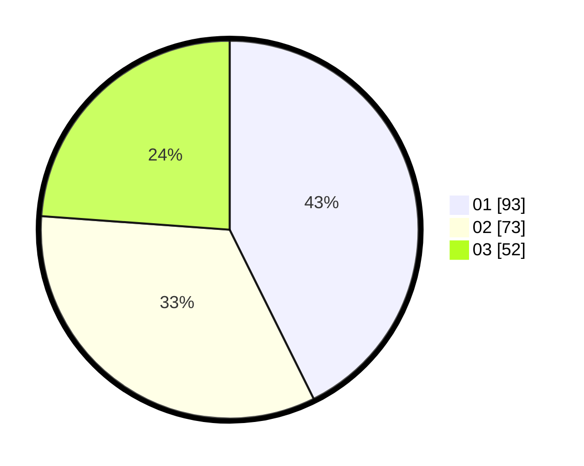

# Hasil

Hasil perolehan suara paslon dapat dilihat pada file paslon-01.txt, paslon-02.txt, dan paslon-03.txt.

Jika tidak ada, artinya data tersebut belum ada pada SIREKAP.

## Perolehan Suara

 * Paslon 01: **93**.
 * Paslon 02: **73**.
 * Paslon 03: **52**.

## Foto C Plano

https://sirekap-obj-formc.kpu.go.id/42b0/pemilu/ppwp/31/75/01/10/03/3175011003054-20240214-211657--9c3d5d9d-4455-4ba9-a757-efe24ab5c51d.jpg

https://sirekap-obj-formc.kpu.go.id/42b0/pemilu/ppwp/31/75/01/10/03/3175011003054-20240214-203825--3ae81445-2953-4a83-a1b2-11752670e3e0.jpg

https://sirekap-obj-formc.kpu.go.id/42b0/pemilu/ppwp/31/75/01/10/03/3175011003054-20240214-211956--56e383da-45f2-4caa-a098-7c76f52249a1.jpg
