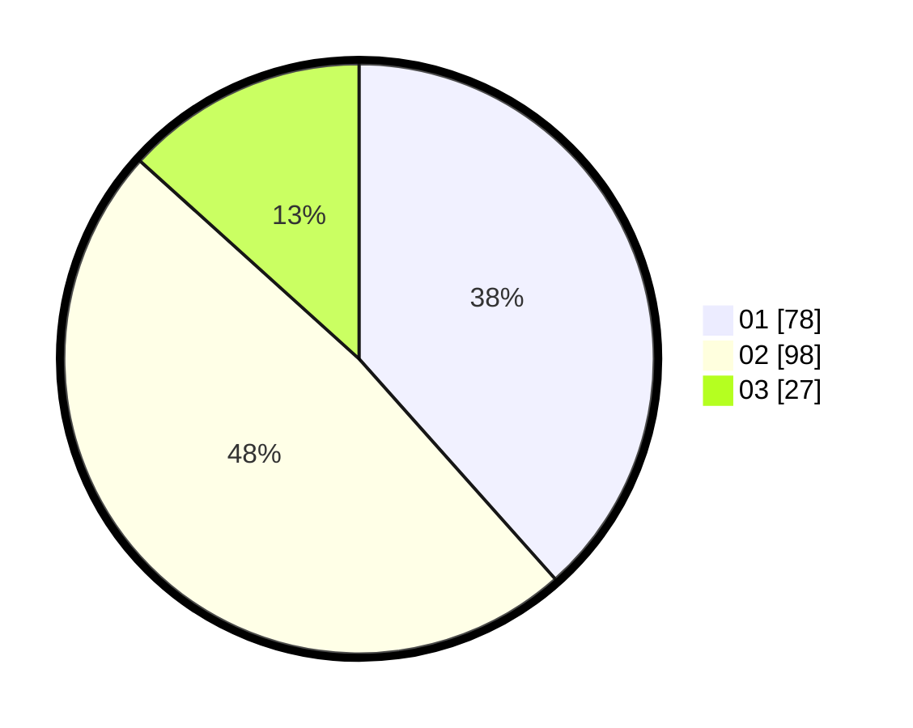

# Hasil

Hasil perolehan suara paslon dapat dilihat pada file paslon-01.txt, paslon-02.txt, dan paslon-03.txt.

Jika tidak ada, artinya data tersebut belum ada pada SIREKAP.

## Perolehan Suara

 * Paslon 01: **78**.
 * Paslon 02: **98**.
 * Paslon 03: **27**.

## Foto C Plano

https://sirekap-obj-formc.kpu.go.id/8a57/pemilu/ppwp/31/75/01/10/03/3175011003055-20240214-190421--5df291d0-d6be-4041-84dc-7facdd39ecdf.jpg

https://sirekap-obj-formc.kpu.go.id/8a57/pemilu/ppwp/31/75/01/10/03/3175011003055-20240214-190555--2e472250-910d-4eba-95cd-9d59c6a3d0e2.jpg

https://sirekap-obj-formc.kpu.go.id/8a57/pemilu/ppwp/31/75/01/10/03/3175011003055-20240214-190721--91ea5d36-c2fc-4fd1-af6e-fab9d6c30d4d.jpg
