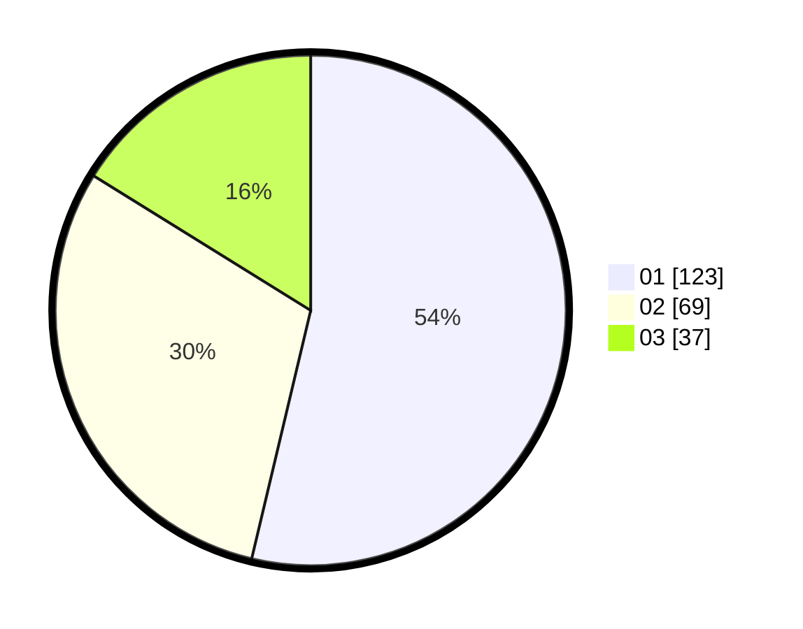

# Hasil

Hasil perolehan suara paslon dapat dilihat pada file paslon-01.txt, paslon-02.txt, dan paslon-03.txt.

Jika tidak ada, artinya data tersebut belum ada pada SIREKAP.

## Perolehan Suara

 * Paslon 01: **123**.
 * Paslon 02: **69**.
 * Paslon 03: **37**.

## Foto C Plano

https://sirekap-obj-formc.kpu.go.id/708d/pemilu/ppwp/31/75/01/10/03/3175011003059-20240214-225641--d1aed282-145f-40d7-8615-b4fd9a148828.jpg

https://sirekap-obj-formc.kpu.go.id/708d/pemilu/ppwp/31/75/01/10/03/3175011003059-20240214-225812--5c073f70-f5cc-4d6e-8504-d87ee52e306d.jpg

https://sirekap-obj-formc.kpu.go.id/708d/pemilu/ppwp/31/75/01/10/03/3175011003059-20240214-230019--34f0b048-4b1c-40d4-8d9a-23e61e93404e.jpg
