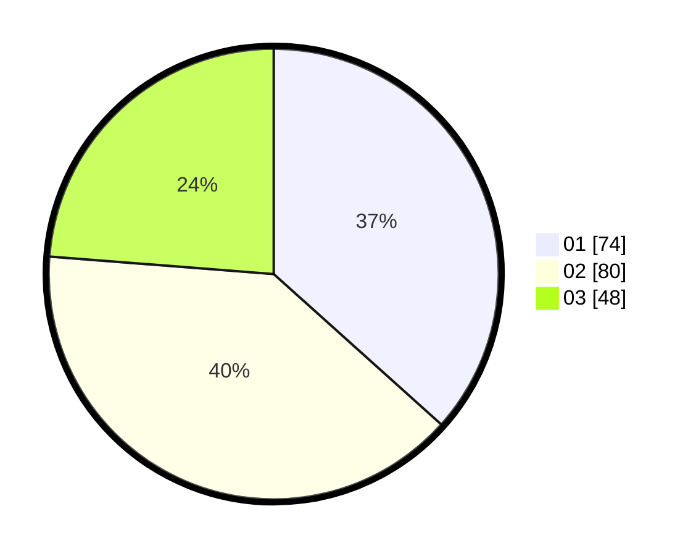

# Hasil

Hasil perolehan suara paslon dapat dilihat pada file paslon-01.txt, paslon-02.txt, dan paslon-03.txt.

Jika tidak ada, artinya data tersebut belum ada pada SIREKAP.

## Perolehan Suara

 * Paslon 01: **74**.
 * Paslon 02: **80**.
 * Paslon 03: **48**.

## Foto C Plano

https://sirekap-obj-formc.kpu.go.id/7226/pemilu/ppwp/31/75/01/10/03/3175011003060-20240214-195757--ed1fc762-4805-4126-9442-f57028b3d356.jpg

https://sirekap-obj-formc.kpu.go.id/7226/pemilu/ppwp/31/75/01/10/03/3175011003060-20240214-204822--4a56caf8-48c6-4639-8b60-f4ab66fd2adc.jpg

https://sirekap-obj-formc.kpu.go.id/7226/pemilu/ppwp/31/75/01/10/03/3175011003060-20240214-195931--be923468-7a9c-4d9a-a1e2-ce21d43cda25.jpg

## DATA PEMILIH TETAP

Jumlah pemilih dalam DPT: **265**.
 * L: **125**.
 * P: **140**.

## DATA PENGGUNA HAK PILIH

Jumlah pengguna hak pilih dalam DPT: **198**.
 * L: **92**.
 * P: **106**.

Jumlah pengguna hak pilih dalam DPTb: **3**.
 * L: **2**.
 * P: **1**.

Jumlah pengguna hak pilih dalam DPK: **2**.
 * L: **1**.
 * P: **1**.

Jumlah pengguna hak pilih: **203**.
 * L: **95**.
 * P: **108**.

## JUMLAH SUARA SAH DAN TIDAK SAH

JUMLAH SELURUH SUARA SAH: **202**.

JUMLAH SUARA TIDAK SAH: **1**.

JUMLAH SELURUH SUARA SAH DAN SUARA TIDAK SAH: **203**.
