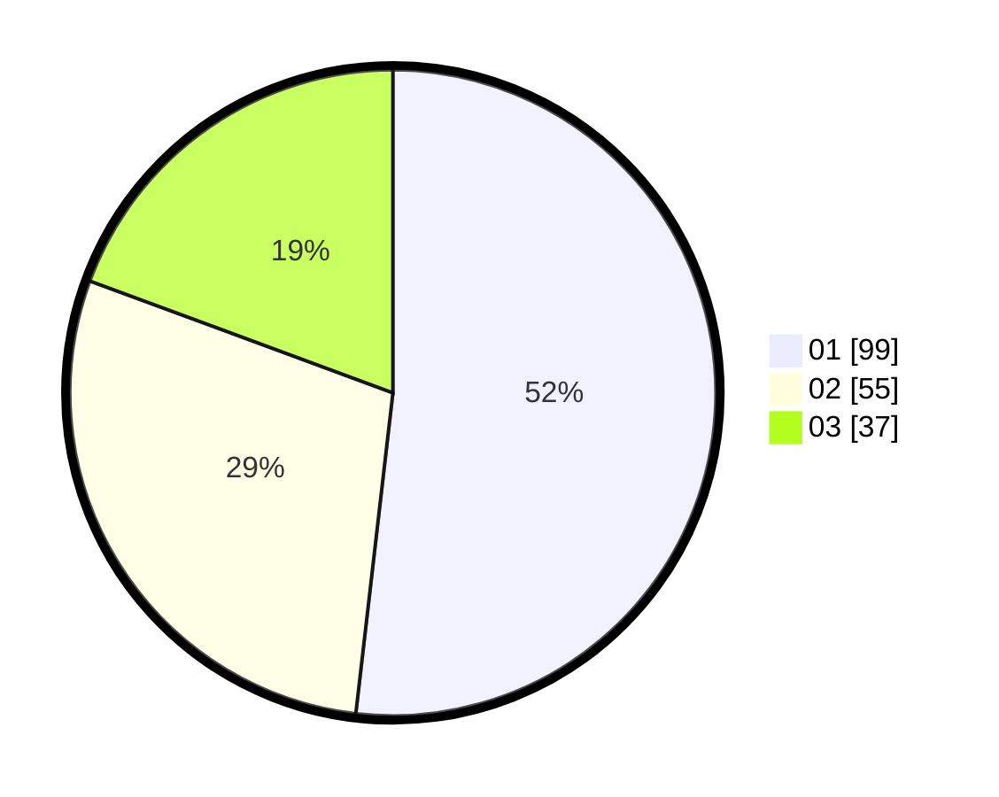

# Hasil

Hasil perolehan suara paslon dapat dilihat pada file paslon-01.txt, paslon-02.txt, dan paslon-03.txt.

Jika tidak ada, artinya data tersebut belum ada pada SIREKAP.

## Perolehan Suara

 * Paslon 01: **99**.
 * Paslon 02: **55**.
 * Paslon 03: **37**.

## Foto C Plano

https://sirekap-obj-formc.kpu.go.id/69de/pemilu/ppwp/31/75/01/10/03/3175011003061-20240216-003216--4a70c719-8801-4a2e-857f-96174952fb58.jpg

https://sirekap-obj-formc.kpu.go.id/69de/pemilu/ppwp/31/75/01/10/03/3175011003061-20240214-203457--c98da450-9409-45ad-9aef-a20674cd424f.jpg

https://sirekap-obj-formc.kpu.go.id/69de/pemilu/ppwp/31/75/01/10/03/3175011003061-20240214-185957--21f40145-87f7-4c46-89cc-cc76a6a63688.jpg

## DATA PEMILIH TETAP

Jumlah pemilih dalam DPT: **267**.
 * L: **130**.
 * P: **137**.

## DATA PENGGUNA HAK PILIH

Jumlah pengguna hak pilih dalam DPT: **191**.
 * L: **102**.
 * P: **89**.

Jumlah pengguna hak pilih dalam DPTb: **0**.
 * L: **0**.
 * P: **0**.

Jumlah pengguna hak pilih dalam DPK: **4**.
 * L: **2**.
 * P: **2**.

Jumlah pengguna hak pilih: **195**.
 * L: **104**.
 * P: **91**.

## JUMLAH SUARA SAH DAN TIDAK SAH

JUMLAH SELURUH SUARA SAH: **191**.

JUMLAH SUARA TIDAK SAH: **4**.

JUMLAH SELURUH SUARA SAH DAN SUARA TIDAK SAH: **195**.
