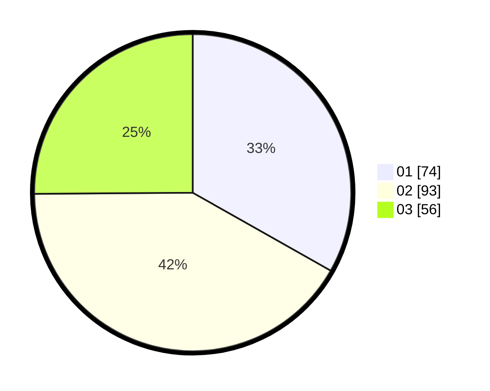

# Hasil

Hasil perolehan suara paslon dapat dilihat pada file paslon-01.txt, paslon-02.txt, dan paslon-03.txt.

Jika tidak ada, artinya data tersebut belum ada pada SIREKAP.

## Perolehan Suara

 * Paslon 01: **74**.
 * Paslon 02: **93**.
 * Paslon 03: **56**.

## Foto C Plano

https://sirekap-obj-formc.kpu.go.id/ca35/pemilu/ppwp/31/75/01/10/03/3175011003066-20240214-185349--84c91f7d-dbff-469f-a896-6fdc4946f936.jpg

https://sirekap-obj-formc.kpu.go.id/ca35/pemilu/ppwp/31/75/01/10/03/3175011003066-20240214-185402--b4bfbc8c-cfd0-4edd-98a7-53a26fbbc5ef.jpg

https://sirekap-obj-formc.kpu.go.id/ca35/pemilu/ppwp/31/75/01/10/03/3175011003066-20240214-185432--6f1cd2e5-8900-45a2-ac3e-24bf476ec8bc.jpg

## DATA PEMILIH TETAP

Jumlah pemilih dalam DPT: **278**.
 * L: **126**.
 * P: **152**.

## DATA PENGGUNA HAK PILIH

Jumlah pengguna hak pilih dalam DPT: **220**.
 * L: **104**.
 * P: **116**.

Jumlah pengguna hak pilih dalam DPTb: **220**.
 * L: **104**.
 * P: **116**.

Jumlah pengguna hak pilih dalam DPK: **1**.
 * L: **0**.
 * P: **1**.

Jumlah pengguna hak pilih: **225**.
 * L: **107**.
 * P: **118**.

## JUMLAH SUARA SAH DAN TIDAK SAH

JUMLAH SELURUH SUARA SAH: **223**.

JUMLAH SUARA TIDAK SAH: **2**.

JUMLAH SELURUH SUARA SAH DAN SUARA TIDAK SAH: **225**.
