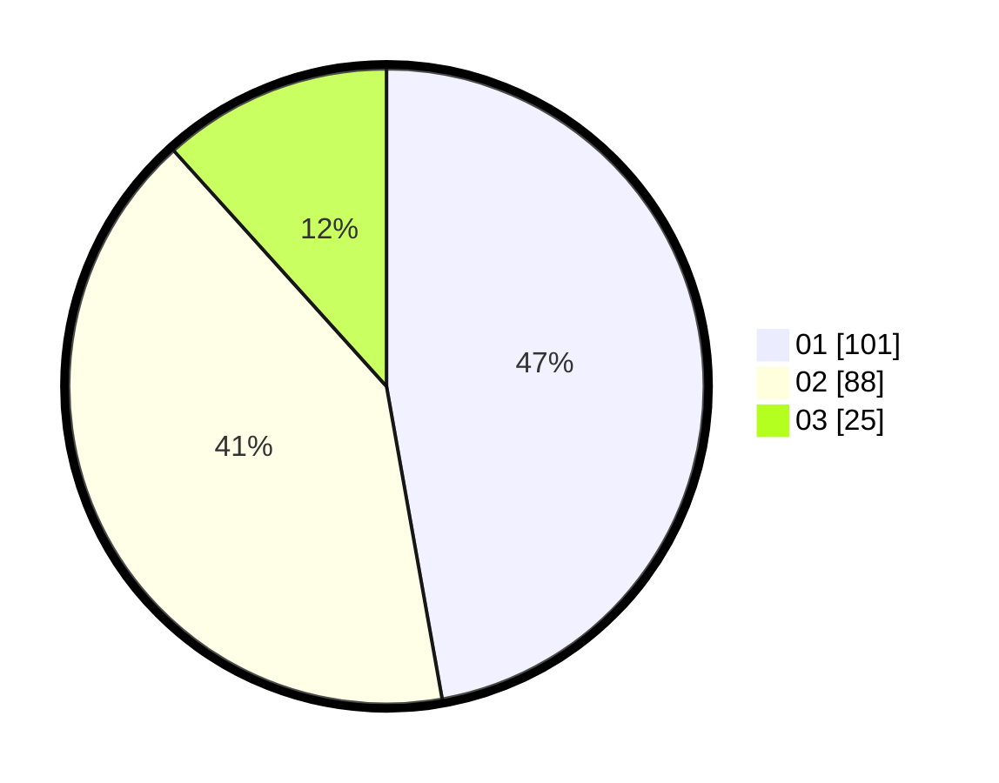

# Hasil

Hasil perolehan suara paslon dapat dilihat pada file paslon-01.txt, paslon-02.txt, dan paslon-03.txt.

Jika tidak ada, artinya data tersebut belum ada pada SIREKAP.

## Perolehan Suara

 * Paslon 01: **101**.
 * Paslon 02: **88**.
 * Paslon 03: **25**.

## Foto C Plano

https://sirekap-obj-formc.kpu.go.id/9956/pemilu/ppwp/31/75/01/10/03/3175011003069-20240214-215524--396536cc-ecf2-4c70-ba38-1cac7cda6b8b.jpg

https://sirekap-obj-formc.kpu.go.id/9956/pemilu/ppwp/31/75/01/10/03/3175011003069-20240214-215647--3d41379e-f6b5-4eaf-aec2-2c5fb41c0ad2.jpg

https://sirekap-obj-formc.kpu.go.id/9956/pemilu/ppwp/31/75/01/10/03/3175011003069-20240214-215950--9589bb91-10f6-4e2d-a698-e391a42c5f85.jpg
