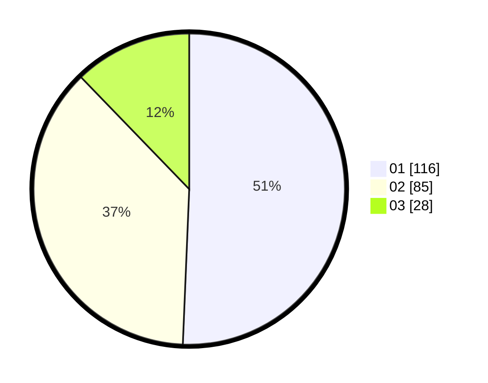

# Hasil

Hasil perolehan suara paslon dapat dilihat pada file paslon-01.txt, paslon-02.txt, dan paslon-03.txt.

Jika tidak ada, artinya data tersebut belum ada pada SIREKAP.

## Perolehan Suara

 * Paslon 01: **116**.
 * Paslon 02: **85**.
 * Paslon 03: **28**.

## Foto C Plano

https://sirekap-obj-formc.kpu.go.id/ef3f/pemilu/ppwp/31/75/01/10/03/3175011003070-20240214-225216--7436a975-8a50-486d-bb11-75fc4324aa66.jpg

https://sirekap-obj-formc.kpu.go.id/ef3f/pemilu/ppwp/31/75/01/10/03/3175011003070-20240214-225459--bc7a803f-9900-49f5-950c-f22f6bff172f.jpg

https://sirekap-obj-formc.kpu.go.id/ef3f/pemilu/ppwp/31/75/01/10/03/3175011003070-20240214-230605--543f6766-69af-440a-b6ed-443df0bfde46.jpg
