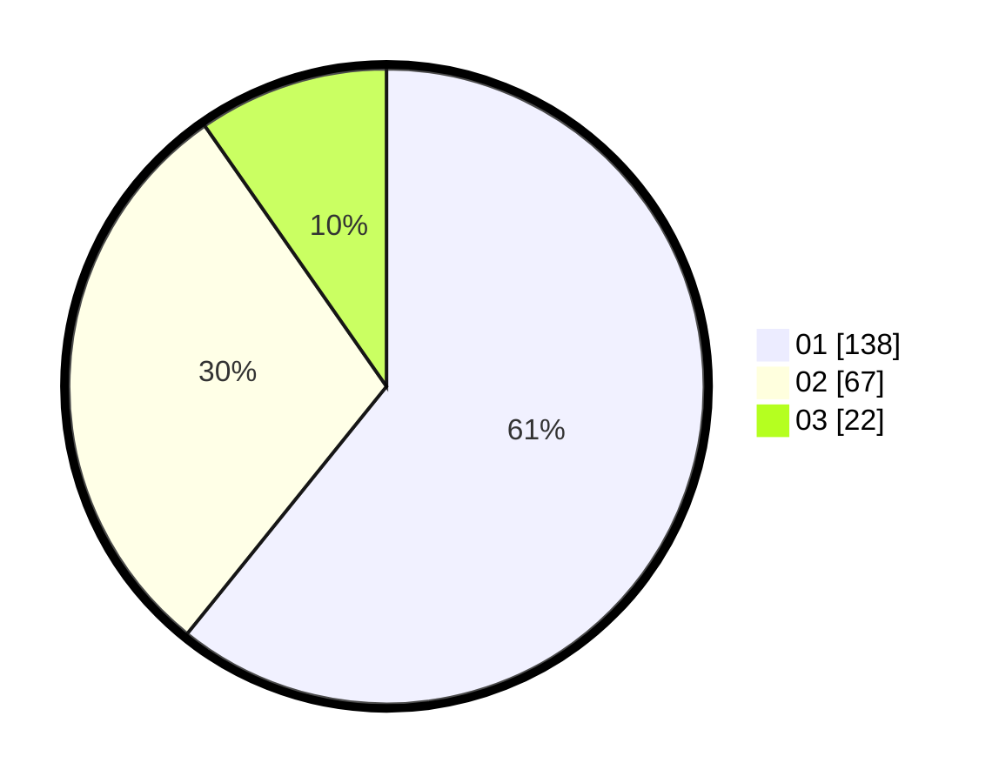

# Hasil

Hasil perolehan suara paslon dapat dilihat pada file paslon-01.txt, paslon-02.txt, dan paslon-03.txt.

Jika tidak ada, artinya data tersebut belum ada pada SIREKAP.

## Perolehan Suara

 * Paslon 01: **138**.
 * Paslon 02: **67**.
 * Paslon 03: **22**.

## Foto C Plano

https://sirekap-obj-formc.kpu.go.id/771f/pemilu/ppwp/31/75/01/10/03/3175011003073-20240214-211617--bc21639a-1f05-4a50-9c29-10d1f7e1a432.jpg

https://sirekap-obj-formc.kpu.go.id/771f/pemilu/ppwp/31/75/01/10/03/3175011003073-20240215-002441--153000ff-37f7-4441-abfe-dc0b3ee2731f.jpg

https://sirekap-obj-formc.kpu.go.id/771f/pemilu/ppwp/31/75/01/10/03/3175011003073-20240214-211757--ff3fea5a-2193-428e-bcd3-6de27c87a15a.jpg

## DATA PEMILIH TETAP

Jumlah pemilih dalam DPT: **280**.
 * L: **131**.
 * P: **149**.

## DATA PENGGUNA HAK PILIH

Jumlah pengguna hak pilih dalam DPT: **222**.
 * L: **122**.
 * P: **100**.

Jumlah pengguna hak pilih dalam DPTb: **5**.
 * L: **2**.
 * P: **3**.

Jumlah pengguna hak pilih dalam DPK: **3**.
 * L: **1**.
 * P: **2**.

Jumlah pengguna hak pilih: **230**.
 * L: **125**.
 * P: **105**.

## JUMLAH SUARA SAH DAN TIDAK SAH

JUMLAH SELURUH SUARA SAH: **227**.

JUMLAH SUARA TIDAK SAH: **3**.

JUMLAH SELURUH SUARA SAH DAN SUARA TIDAK SAH: **230**.
