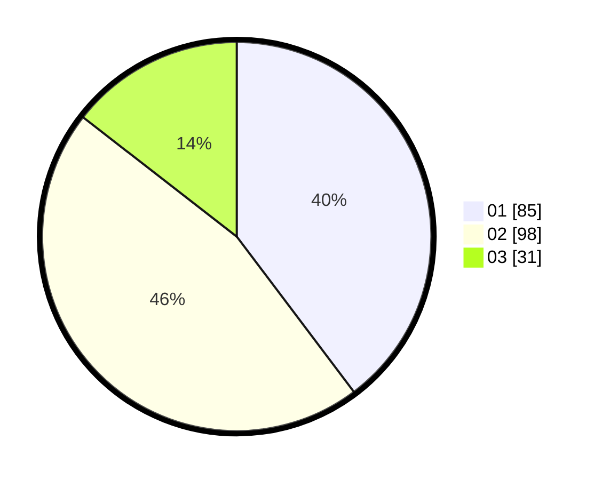

# Hasil

Hasil perolehan suara paslon dapat dilihat pada file paslon-01.txt, paslon-02.txt, dan paslon-03.txt.

Jika tidak ada, artinya data tersebut belum ada pada SIREKAP.

## Perolehan Suara

 * Paslon 01: **85**.
 * Paslon 02: **98**.
 * Paslon 03: **31**.

## Foto C Plano

https://sirekap-obj-formc.kpu.go.id/bcea/pemilu/ppwp/31/75/01/10/03/3175011003076-20240214-223026--9ebfeced-1986-4b83-9c27-c513ac623d21.jpg

https://sirekap-obj-formc.kpu.go.id/bcea/pemilu/ppwp/31/75/01/10/03/3175011003076-20240214-223103--fee8af5e-11ce-4409-bbad-19bc7ebe6ae2.jpg

https://sirekap-obj-formc.kpu.go.id/bcea/pemilu/ppwp/31/75/01/10/03/3175011003076-20240214-223134--e9f1c51b-d4b4-45a8-81e7-7f03d7270aa0.jpg
