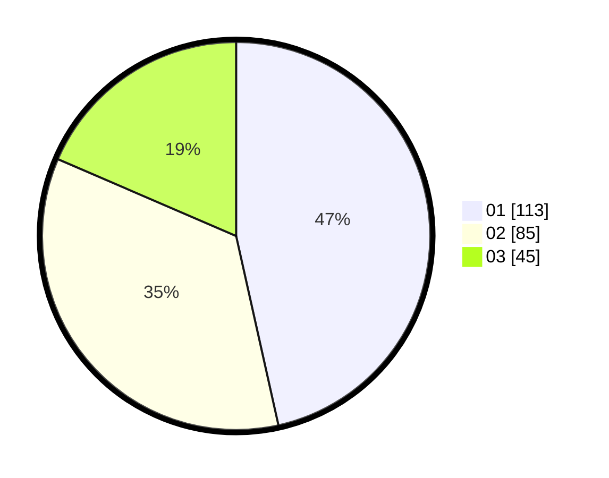

# Hasil

Hasil perolehan suara paslon dapat dilihat pada file paslon-01.txt, paslon-02.txt, dan paslon-03.txt.

Jika tidak ada, artinya data tersebut belum ada pada SIREKAP.

## Perolehan Suara

 * Paslon 01: **113**.
 * Paslon 02: **85**.
 * Paslon 03: **45**.

## Foto C Plano

https://sirekap-obj-formc.kpu.go.id/13e3/pemilu/ppwp/31/75/01/10/03/3175011003078-20240214-230329--a4526cf8-6bc3-4b55-bddd-642e4b3a0eba.jpg

https://sirekap-obj-formc.kpu.go.id/13e3/pemilu/ppwp/31/75/01/10/03/3175011003078-20240214-200652--522b1c3d-5d14-4035-8491-f9b234e681f3.jpg

https://sirekap-obj-formc.kpu.go.id/13e3/pemilu/ppwp/31/75/01/10/03/3175011003078-20240214-214217--0827a400-b16a-4387-9451-ef96113c0dfb.jpg
