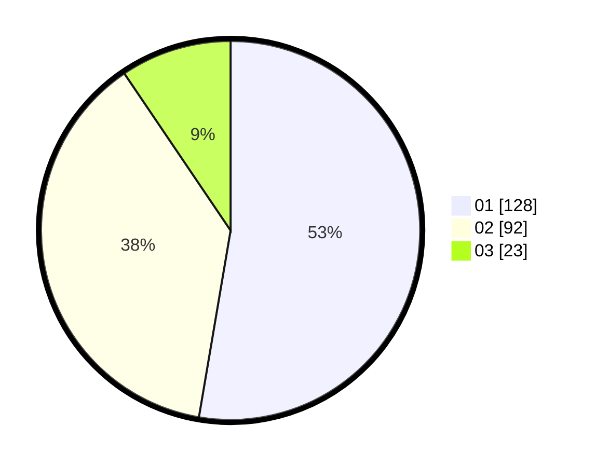

# Hasil

Hasil perolehan suara paslon dapat dilihat pada file paslon-01.txt, paslon-02.txt, dan paslon-03.txt.

Jika tidak ada, artinya data tersebut belum ada pada SIREKAP.

## Perolehan Suara

 * Paslon 01: **128**.
 * Paslon 02: **92**.
 * Paslon 03: **23**.

## Foto C Plano

https://sirekap-obj-formc.kpu.go.id/d174/pemilu/ppwp/31/75/01/10/03/3175011003079-20240214-193614--b95a6c48-b288-4f5c-a801-5ef7930c5cc6.jpg

https://sirekap-obj-formc.kpu.go.id/d174/pemilu/ppwp/31/75/01/10/03/3175011003079-20240214-193748--47099362-2a70-4fb7-af6d-773cd97eecee.jpg

https://sirekap-obj-formc.kpu.go.id/d174/pemilu/ppwp/31/75/01/10/03/3175011003079-20240214-193948--e268a4a7-812d-40de-a3f1-253be7ba7b1e.jpg

## DATA PEMILIH TETAP

Jumlah pemilih dalam DPT: **294**.
 * L: **150**.
 * P: **144**.

## DATA PENGGUNA HAK PILIH

Jumlah pengguna hak pilih dalam DPT: **240**.
 * L: **118**.
 * P: **122**.

Jumlah pengguna hak pilih dalam DPTb: **3**.
 * L: **0**.
 * P: **3**.

Jumlah pengguna hak pilih dalam DPK: **6**.
 * L: **4**.
 * P: **2**.

Jumlah pengguna hak pilih: **249**.
 * L: **122**.
 * P: **127**.

## JUMLAH SUARA SAH DAN TIDAK SAH

JUMLAH SELURUH SUARA SAH: **243**.

JUMLAH SUARA TIDAK SAH: **6**.

JUMLAH SELURUH SUARA SAH DAN SUARA TIDAK SAH: **249**.
