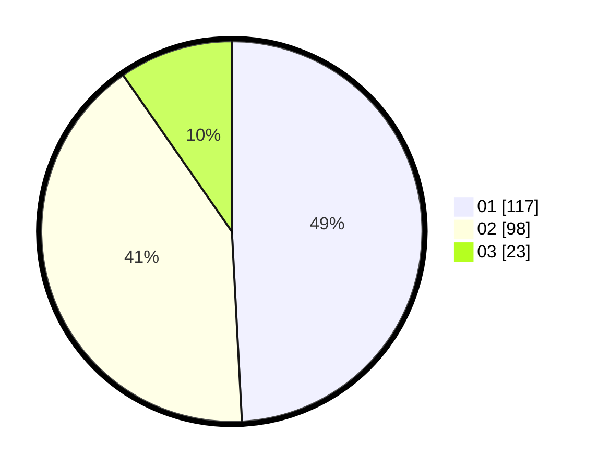

# Hasil

Hasil perolehan suara paslon dapat dilihat pada file paslon-01.txt, paslon-02.txt, dan paslon-03.txt.

Jika tidak ada, artinya data tersebut belum ada pada SIREKAP.

## Perolehan Suara

 * Paslon 01: **117**.
 * Paslon 02: **98**.
 * Paslon 03: **23**.

## Foto C Plano

https://sirekap-obj-formc.kpu.go.id/5b5b/pemilu/ppwp/31/75/01/10/03/3175011003080-20240214-175323--b32c9fd7-cac5-4aee-a147-6d13e01e7af2.jpg

https://sirekap-obj-formc.kpu.go.id/5b5b/pemilu/ppwp/31/75/01/10/03/3175011003080-20240214-185158--1919bcb0-2940-43ba-816a-e9ad0c291b5d.jpg

https://sirekap-obj-formc.kpu.go.id/5b5b/pemilu/ppwp/31/75/01/10/03/3175011003080-20240214-180016--5e33b604-74f6-45c5-b6db-7034bcf8b342.jpg

## DATA PEMILIH TETAP

Jumlah pemilih dalam DPT: **290**.
 * L: **141**.
 * P: **149**.

## DATA PENGGUNA HAK PILIH

Jumlah pengguna hak pilih dalam DPT: **237**.
 * L: **110**.
 * P: **127**.

Jumlah pengguna hak pilih dalam DPTb: **0**.
 * L: **0**.
 * P: **0**.

Jumlah pengguna hak pilih dalam DPK: **3**.
 * L: **3**.
 * P: **0**.

Jumlah pengguna hak pilih: **240**.
 * L: **113**.
 * P: **127**.

## JUMLAH SUARA SAH DAN TIDAK SAH

JUMLAH SELURUH SUARA SAH: **238**.

JUMLAH SUARA TIDAK SAH: **2**.

JUMLAH SELURUH SUARA SAH DAN SUARA TIDAK SAH: **240**.
