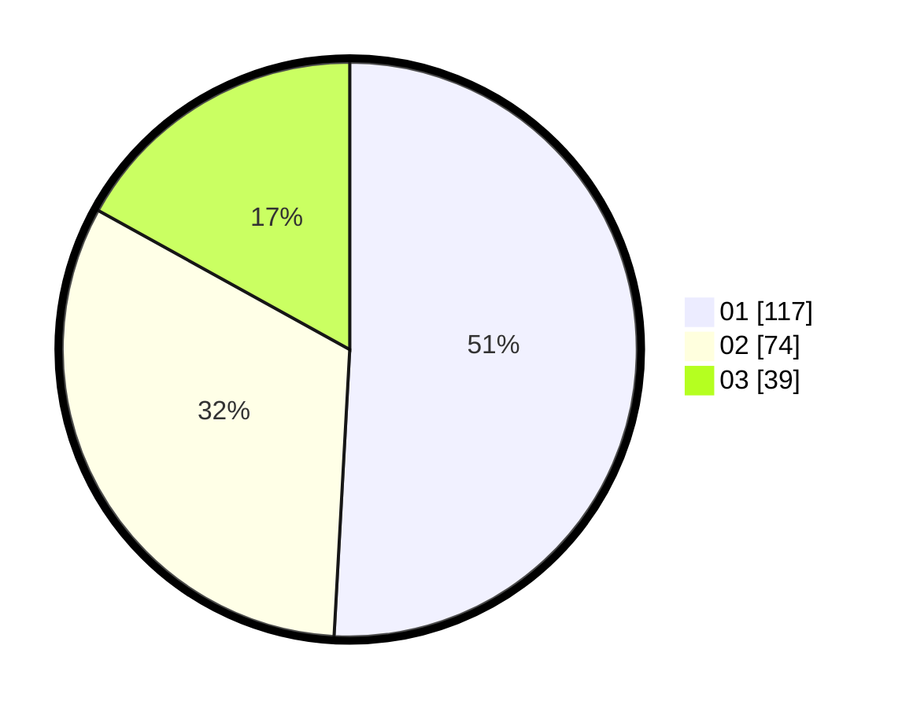

# Hasil

Hasil perolehan suara paslon dapat dilihat pada file paslon-01.txt, paslon-02.txt, dan paslon-03.txt.

Jika tidak ada, artinya data tersebut belum ada pada SIREKAP.

## Perolehan Suara

 * Paslon 01: **117**.
 * Paslon 02: **74**.
 * Paslon 03: **39**.

## Foto C Plano

https://sirekap-obj-formc.kpu.go.id/a504/pemilu/ppwp/31/75/01/10/03/3175011003081-20240214-223713--757d1b5f-9765-4ea7-ac31-4cf5de87932e.jpg

https://sirekap-obj-formc.kpu.go.id/a504/pemilu/ppwp/31/75/01/10/03/3175011003081-20240214-223900--1a34da15-f4bb-4c95-bb73-13ad3971b79b.jpg

https://sirekap-obj-formc.kpu.go.id/a504/pemilu/ppwp/31/75/01/10/03/3175011003081-20240214-224055--1a16ab53-631a-4e09-b818-3a5fd8356176.jpg
