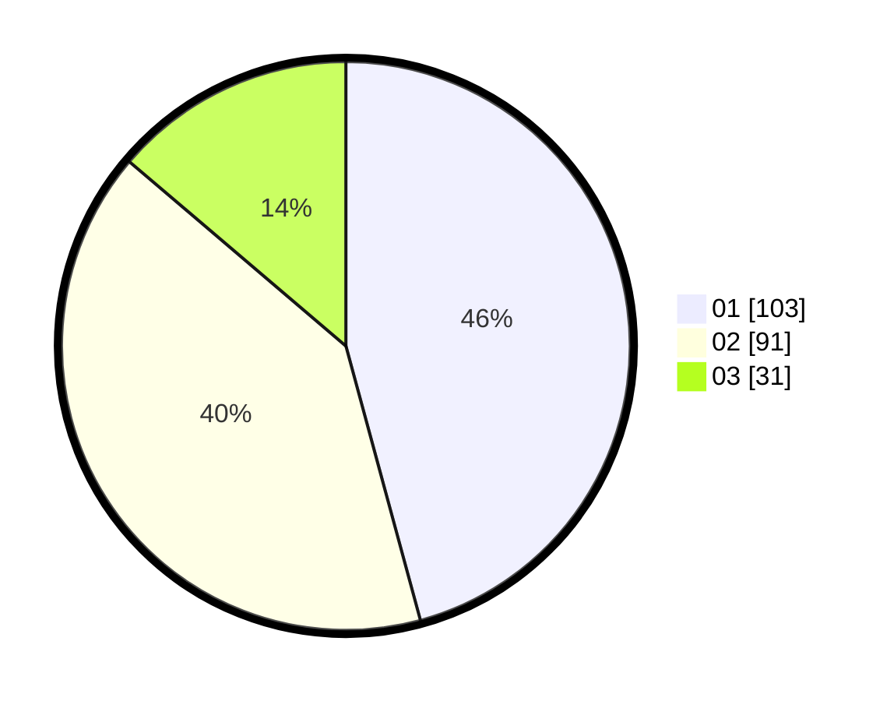

# Hasil

Hasil perolehan suara paslon dapat dilihat pada file paslon-01.txt, paslon-02.txt, dan paslon-03.txt.

Jika tidak ada, artinya data tersebut belum ada pada SIREKAP.

## Perolehan Suara

 * Paslon 01: **103**.
 * Paslon 02: **91**.
 * Paslon 03: **31**.

## Foto C Plano

https://sirekap-obj-formc.kpu.go.id/6d1f/pemilu/ppwp/31/75/01/10/03/3175011003083-20240216-205320--ff742ff5-a423-4e8b-8046-e8166556fdbd.jpg

https://sirekap-obj-formc.kpu.go.id/6d1f/pemilu/ppwp/31/75/01/10/03/3175011003083-20240216-205858--4cbccd7a-0b16-44d3-a561-2744724f2555.jpg

https://sirekap-obj-formc.kpu.go.id/6d1f/pemilu/ppwp/31/75/01/10/03/3175011003083-20240216-210703--294483c0-6b83-4bbc-8b31-18ad0008402a.jpg

## DATA PEMILIH TETAP

Jumlah pemilih dalam DPT: **290**.
 * L: **137**.
 * P: **153**.

## DATA PENGGUNA HAK PILIH

Jumlah pengguna hak pilih dalam DPT: **226**.
 * L: **105**.
 * P: **121**.

Jumlah pengguna hak pilih dalam DPTb: **1**.
 * L: **1**.
 * P: **0**.

Jumlah pengguna hak pilih dalam DPK: **0**.
 * L: **0**.
 * P: **0**.

Jumlah pengguna hak pilih: **227**.
 * L: **106**.
 * P: **121**.

## JUMLAH SUARA SAH DAN TIDAK SAH

JUMLAH SELURUH SUARA SAH: **225**.

JUMLAH SUARA TIDAK SAH: **2**.

JUMLAH SELURUH SUARA SAH DAN SUARA TIDAK SAH: **227**.
