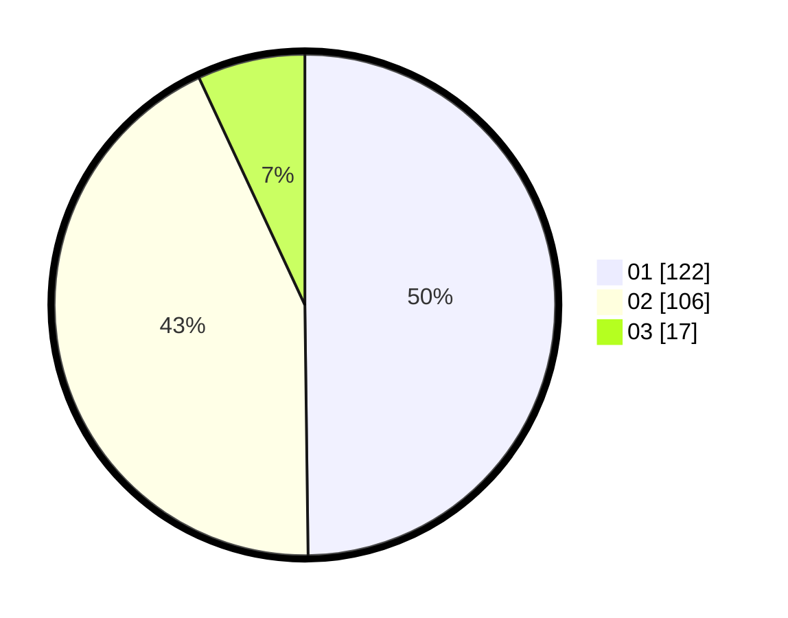

# Hasil

Hasil perolehan suara paslon dapat dilihat pada file paslon-01.txt, paslon-02.txt, dan paslon-03.txt.

Jika tidak ada, artinya data tersebut belum ada pada SIREKAP.

## Perolehan Suara

 * Paslon 01: **122**.
 * Paslon 02: **106**.
 * Paslon 03: **17**.

## Foto C Plano

https://sirekap-obj-formc.kpu.go.id/4255/pemilu/ppwp/31/75/01/10/04/3175011004002-20240214-211302--3e7250fa-9866-435a-b756-edfbadfb826b.jpg

https://sirekap-obj-formc.kpu.go.id/4255/pemilu/ppwp/31/75/01/10/04/3175011004002-20240214-211216--994ad7cc-952b-42ca-ac02-48af018567b2.jpg

https://sirekap-obj-formc.kpu.go.id/4255/pemilu/ppwp/31/75/01/10/04/3175011004002-20240214-211236--2dd96429-4927-4ddc-a66a-f80991e5a4c0.jpg

## DATA PEMILIH TETAP

Jumlah pemilih dalam DPT: **281**.
 * L: **147**.
 * P: **134**.

## DATA PENGGUNA HAK PILIH

Jumlah pengguna hak pilih dalam DPT: **233**.
 * L: **119**.
 * P: **114**.

Jumlah pengguna hak pilih dalam DPTb: **11**.
 * L: **5**.
 * P: **6**.

Jumlah pengguna hak pilih dalam DPK: **2**.
 * L: **1**.
 * P: **1**.

Jumlah pengguna hak pilih: **246**.
 * L: **125**.
 * P: **121**.

## JUMLAH SUARA SAH DAN TIDAK SAH

JUMLAH SELURUH SUARA SAH: **245**.

JUMLAH SUARA TIDAK SAH: **1**.

JUMLAH SELURUH SUARA SAH DAN SUARA TIDAK SAH: **246**.
