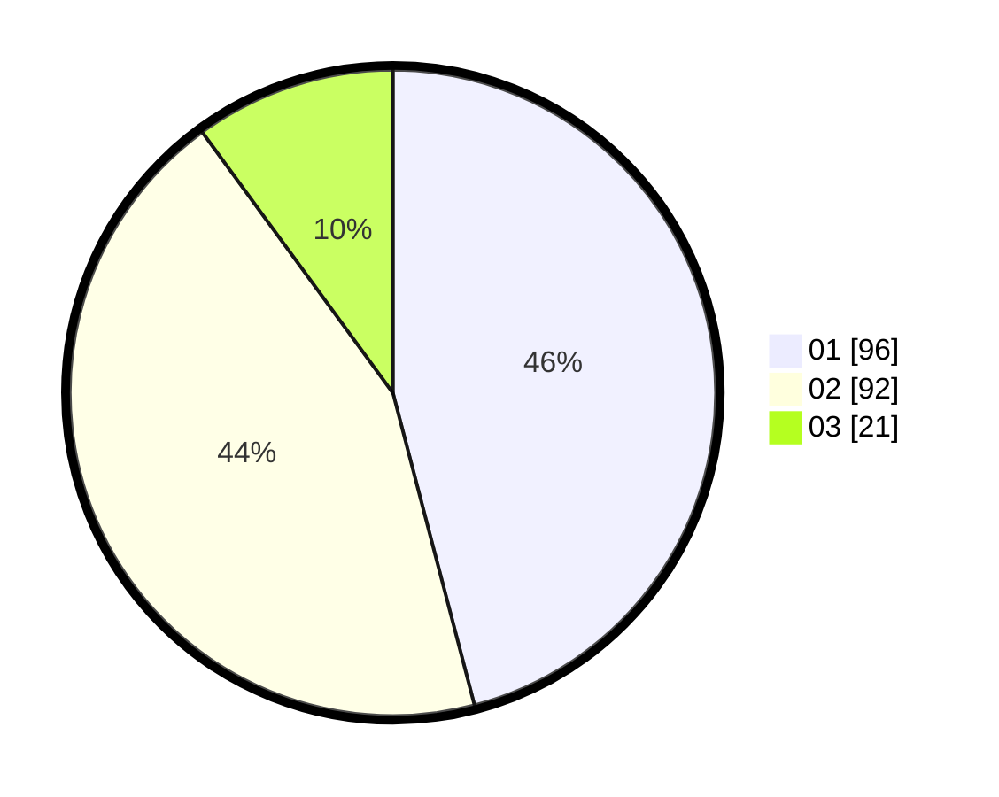

# Hasil

Hasil perolehan suara paslon dapat dilihat pada file paslon-01.txt, paslon-02.txt, dan paslon-03.txt.

Jika tidak ada, artinya data tersebut belum ada pada SIREKAP.

## Perolehan Suara

 * Paslon 01: **96**.
 * Paslon 02: **92**.
 * Paslon 03: **21**.

## Foto C Plano

https://sirekap-obj-formc.kpu.go.id/3f5b/pemilu/ppwp/31/75/01/10/04/3175011004003-20240216-062601--b3892d06-d755-49c1-8a3c-5b1bf3dac3b5.jpg

https://sirekap-obj-formc.kpu.go.id/3f5b/pemilu/ppwp/31/75/01/10/04/3175011004003-20240214-204141--930bf8da-dbb5-4f15-b8eb-c033378c2ef3.jpg

https://sirekap-obj-formc.kpu.go.id/3f5b/pemilu/ppwp/31/75/01/10/04/3175011004003-20240214-205531--7b1fced7-9351-402f-ab98-22ee84bb25f3.jpg

## DATA PEMILIH TETAP

Jumlah pemilih dalam DPT: **283**.
 * L: **143**.
 * P: **140**.

## DATA PENGGUNA HAK PILIH

Jumlah pengguna hak pilih dalam DPT: **203**.
 * L: **98**.
 * P: **105**.

Jumlah pengguna hak pilih dalam DPTb: **7**.
 * L: **1**.
 * P: **6**.

Jumlah pengguna hak pilih dalam DPK: **1**.
 * L: **1**.
 * P: **0**.

Jumlah pengguna hak pilih: **211**.
 * L: **100**.
 * P: **111**.

## JUMLAH SUARA SAH DAN TIDAK SAH

JUMLAH SELURUH SUARA SAH: **209**.

JUMLAH SUARA TIDAK SAH: **2**.

JUMLAH SELURUH SUARA SAH DAN SUARA TIDAK SAH: **211**.
