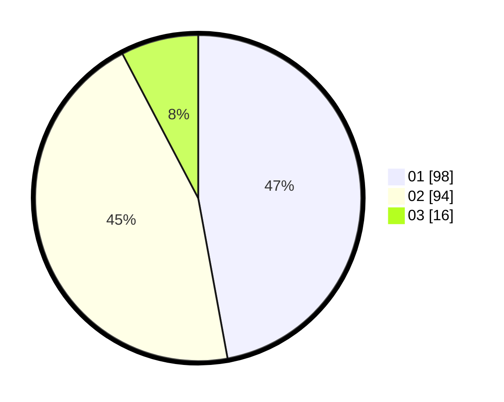

# Hasil

Hasil perolehan suara paslon dapat dilihat pada file paslon-01.txt, paslon-02.txt, dan paslon-03.txt.

Jika tidak ada, artinya data tersebut belum ada pada SIREKAP.

## Perolehan Suara

 * Paslon 01: **98**.
 * Paslon 02: **94**.
 * Paslon 03: **16**.

## Foto C Plano

https://sirekap-obj-formc.kpu.go.id/378e/pemilu/ppwp/31/75/01/10/04/3175011004005-20240215-015818--35440c85-64d9-49ef-b02f-60b1a76640b3.jpg

https://sirekap-obj-formc.kpu.go.id/378e/pemilu/ppwp/31/75/01/10/04/3175011004005-20240215-023028--5e935e2f-5cc6-4aa9-a9f1-354ceba4f41a.jpg

https://sirekap-obj-formc.kpu.go.id/378e/pemilu/ppwp/31/75/01/10/04/3175011004005-20240215-020103--b2fd773a-bb0a-427d-b835-f87f6280327d.jpg
