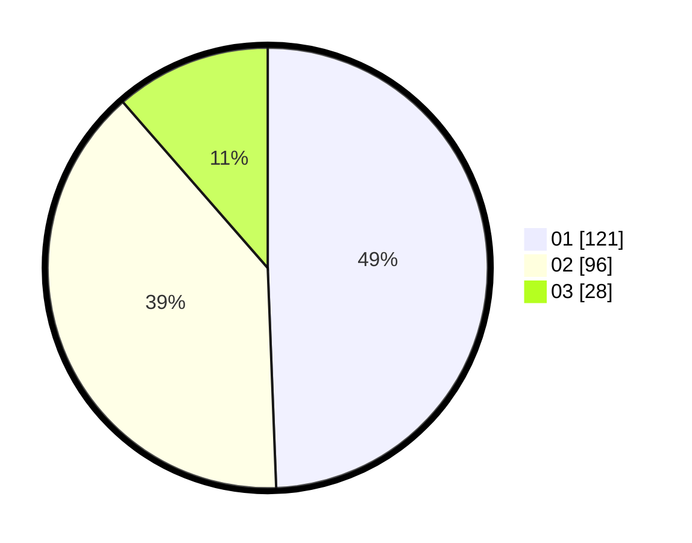

# Hasil

Hasil perolehan suara paslon dapat dilihat pada file paslon-01.txt, paslon-02.txt, dan paslon-03.txt.

Jika tidak ada, artinya data tersebut belum ada pada SIREKAP.

## Perolehan Suara

 * Paslon 01: **121**.
 * Paslon 02: **96**.
 * Paslon 03: **28**.

## Foto C Plano

https://sirekap-obj-formc.kpu.go.id/1c8b/pemilu/ppwp/31/75/01/10/04/3175011004008-20240216-131428--aaff922b-5d90-4a96-817f-f6dbfdde65ef.jpg

https://sirekap-obj-formc.kpu.go.id/1c8b/pemilu/ppwp/31/75/01/10/04/3175011004008-20240216-131429--56361251-b1e0-4923-95b6-a111929161d0.jpg

https://sirekap-obj-formc.kpu.go.id/1c8b/pemilu/ppwp/31/75/01/10/04/3175011004008-20240216-131428--9ace87a7-d636-4819-aece-7d26d405c4e4.jpg

## DATA PEMILIH TETAP

Jumlah pemilih dalam DPT: **291**.
 * L: **147**.
 * P: **144**.

## DATA PENGGUNA HAK PILIH

Jumlah pengguna hak pilih dalam DPT: **239**.
 * L: **114**.
 * P: **125**.

Jumlah pengguna hak pilih dalam DPTb: **7**.
 * L: **0**.
 * P: **7**.

Jumlah pengguna hak pilih dalam DPK: **2**.
 * L: **0**.
 * P: **2**.

Jumlah pengguna hak pilih: **248**.
 * L: **114**.
 * P: **134**.

## JUMLAH SUARA SAH DAN TIDAK SAH

JUMLAH SELURUH SUARA SAH: **245**.

JUMLAH SUARA TIDAK SAH: **3**.

JUMLAH SELURUH SUARA SAH DAN SUARA TIDAK SAH: **248**.
