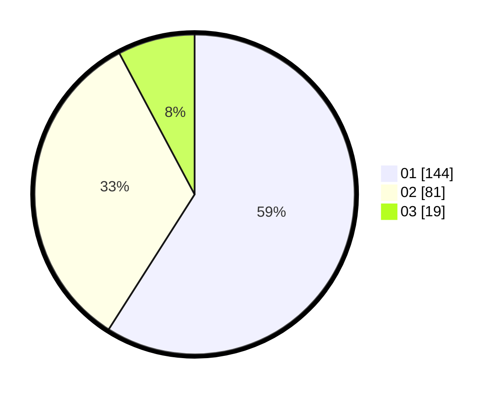

# Hasil

Hasil perolehan suara paslon dapat dilihat pada file paslon-01.txt, paslon-02.txt, dan paslon-03.txt.

Jika tidak ada, artinya data tersebut belum ada pada SIREKAP.

## Perolehan Suara

 * Paslon 01: **144**.
 * Paslon 02: **81**.
 * Paslon 03: **19**.

## Foto C Plano

https://sirekap-obj-formc.kpu.go.id/1dec/pemilu/ppwp/31/75/01/10/04/3175011004009-20240215-022308--0c9b0488-104f-4be4-bf6d-3c9e7a64b539.jpg

https://sirekap-obj-formc.kpu.go.id/1dec/pemilu/ppwp/31/75/01/10/04/3175011004009-20240215-022415--48cd09f5-1688-46c6-b02f-611fb7a06af2.jpg

https://sirekap-obj-formc.kpu.go.id/1dec/pemilu/ppwp/31/75/01/10/04/3175011004009-20240215-022518--708f6f11-19fb-4290-860d-34fcb9ae9ead.jpg
