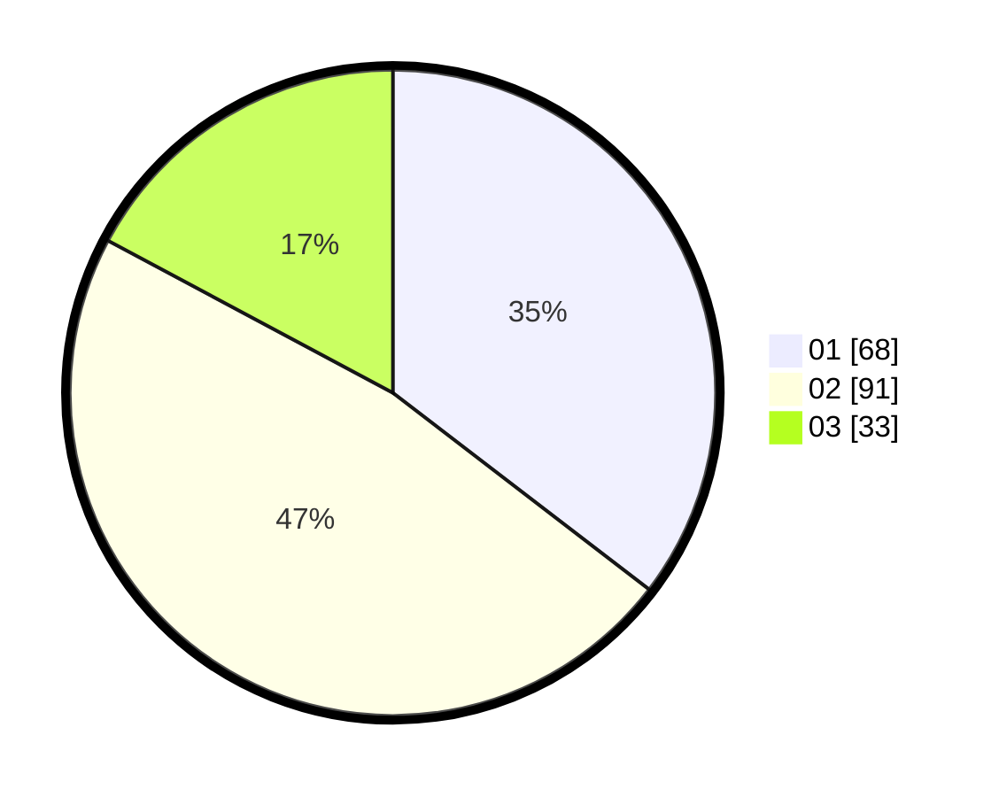

# Hasil

Hasil perolehan suara paslon dapat dilihat pada file paslon-01.txt, paslon-02.txt, dan paslon-03.txt.

Jika tidak ada, artinya data tersebut belum ada pada SIREKAP.

## Perolehan Suara

 * Paslon 01: **68**.
 * Paslon 02: **91**.
 * Paslon 03: **33**.

## Foto C Plano

https://sirekap-obj-formc.kpu.go.id/3789/pemilu/ppwp/31/75/01/10/04/3175011004013-20240214-191414--a6711fdd-82aa-4f84-a2e5-cc62d5fae5dd.jpg

https://sirekap-obj-formc.kpu.go.id/3789/pemilu/ppwp/31/75/01/10/04/3175011004013-20240215-000850--0a95ac70-f6fb-47a7-806d-10d138af6965.jpg

https://sirekap-obj-formc.kpu.go.id/3789/pemilu/ppwp/31/75/01/10/04/3175011004013-20240215-001148--0e0beb4b-c327-4845-89ef-df870d8fd8e5.jpg

## DATA PEMILIH TETAP

Jumlah pemilih dalam DPT: **266**.
 * L: **135**.
 * P: **131**.

## DATA PENGGUNA HAK PILIH

Jumlah pengguna hak pilih dalam DPT: **189**.
 * L: **90**.
 * P: **99**.

Jumlah pengguna hak pilih dalam DPTb: **5**.
 * L: **1**.
 * P: **4**.

Jumlah pengguna hak pilih dalam DPK: **0**.
 * L: **0**.
 * P: **0**.

Jumlah pengguna hak pilih: **194**.
 * L: **91**.
 * P: **103**.

## JUMLAH SUARA SAH DAN TIDAK SAH

JUMLAH SELURUH SUARA SAH: **192**.

JUMLAH SUARA TIDAK SAH: **2**.

JUMLAH SELURUH SUARA SAH DAN SUARA TIDAK SAH: **194**.
