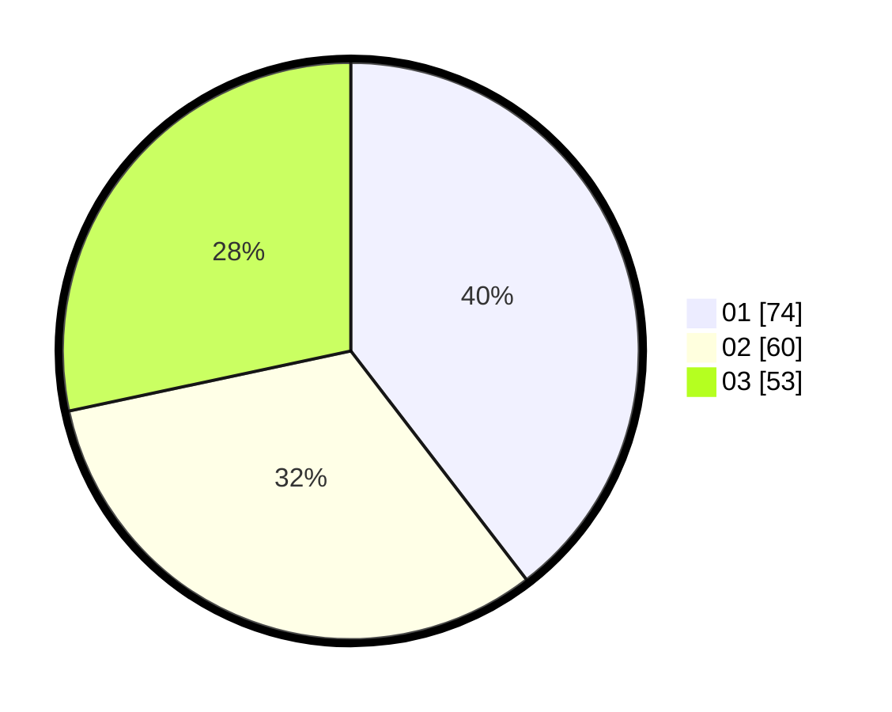

# Hasil

Hasil perolehan suara paslon dapat dilihat pada file paslon-01.txt, paslon-02.txt, dan paslon-03.txt.

Jika tidak ada, artinya data tersebut belum ada pada SIREKAP.

## Perolehan Suara

 * Paslon 01: **74**.
 * Paslon 02: **60**.
 * Paslon 03: **53**.

## Foto C Plano

https://sirekap-obj-formc.kpu.go.id/b423/pemilu/ppwp/31/75/01/10/04/3175011004014-20240215-015929--5cb10925-66f3-4627-b3d4-e57f5af557fc.jpg

https://sirekap-obj-formc.kpu.go.id/b423/pemilu/ppwp/31/75/01/10/04/3175011004014-20240215-020104--405eccbf-efda-4b12-9a16-81fe364bb4d7.jpg

https://sirekap-obj-formc.kpu.go.id/b423/pemilu/ppwp/31/75/01/10/04/3175011004014-20240215-020518--70082097-b44e-4e16-9fb0-f603ed7a7af3.jpg

## DATA PEMILIH TETAP

Jumlah pemilih dalam DPT: **278**.
 * L: **135**.
 * P: **143**.

## DATA PENGGUNA HAK PILIH

Jumlah pengguna hak pilih dalam DPT: **186**.
 * L: **87**.
 * P: **99**.

Jumlah pengguna hak pilih dalam DPTb: **1**.
 * L: **0**.
 * P: **1**.

Jumlah pengguna hak pilih dalam DPK: **3**.
 * L: **1**.
 * P: **2**.

Jumlah pengguna hak pilih: **190**.
 * L: **88**.
 * P: **102**.

## JUMLAH SUARA SAH DAN TIDAK SAH

JUMLAH SELURUH SUARA SAH: **187**.

JUMLAH SUARA TIDAK SAH: **3**.

JUMLAH SELURUH SUARA SAH DAN SUARA TIDAK SAH: **190**.
