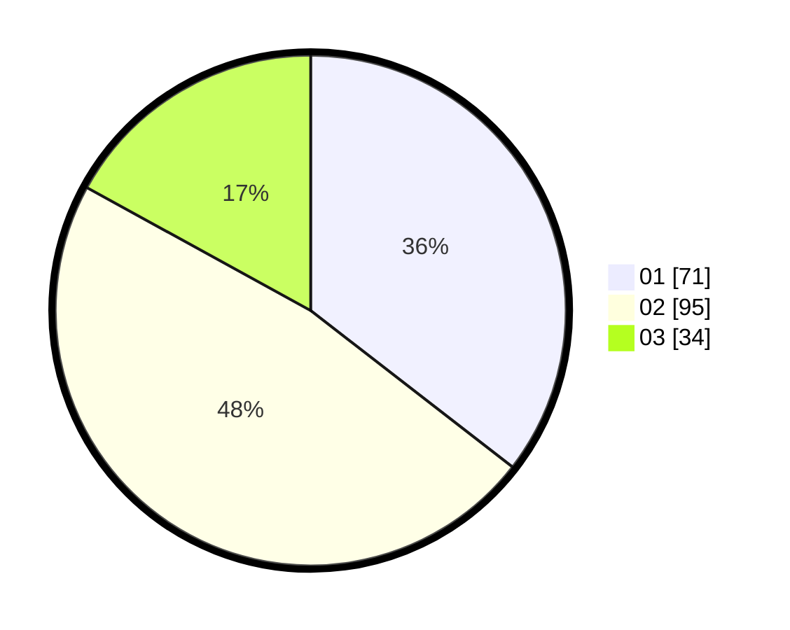

# Hasil

Hasil perolehan suara paslon dapat dilihat pada file paslon-01.txt, paslon-02.txt, dan paslon-03.txt.

Jika tidak ada, artinya data tersebut belum ada pada SIREKAP.

## Perolehan Suara

 * Paslon 01: **71**.
 * Paslon 02: **95**.
 * Paslon 03: **34**.

## Foto C Plano

https://sirekap-obj-formc.kpu.go.id/71ea/pemilu/ppwp/31/75/01/10/04/3175011004015-20240215-010124--9d1f10e6-0279-4c40-9486-1628f6d44715.jpg

https://sirekap-obj-formc.kpu.go.id/71ea/pemilu/ppwp/31/75/01/10/04/3175011004015-20240214-200126--8f2888f0-e10a-4a34-a8cf-8cc061dd3843.jpg

https://sirekap-obj-formc.kpu.go.id/71ea/pemilu/ppwp/31/75/01/10/04/3175011004015-20240215-010329--10bc3eed-e3b6-4c21-aebd-2ce76ce772d8.jpg
