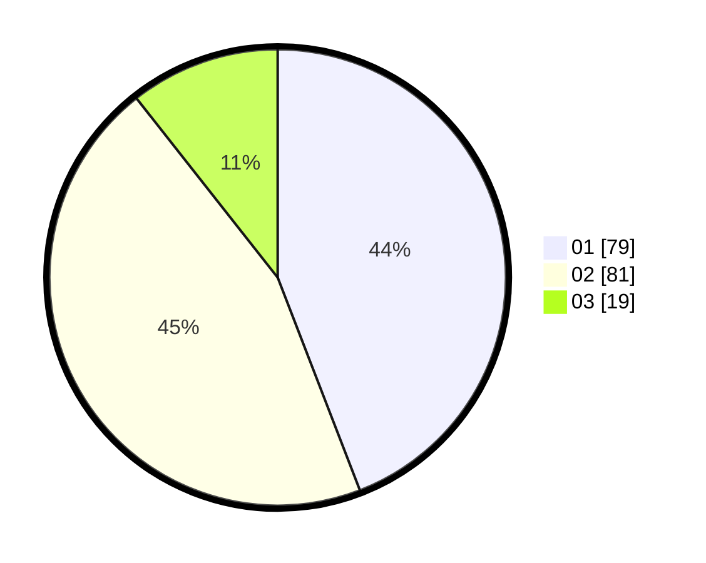

# Hasil

Hasil perolehan suara paslon dapat dilihat pada file paslon-01.txt, paslon-02.txt, dan paslon-03.txt.

Jika tidak ada, artinya data tersebut belum ada pada SIREKAP.

## Perolehan Suara

 * Paslon 01: **79**.
 * Paslon 02: **81**.
 * Paslon 03: **19**.

## Foto C Plano

https://sirekap-obj-formc.kpu.go.id/2881/pemilu/ppwp/31/75/01/10/04/3175011004019-20240214-215902--7267f5d6-69d5-4404-960f-6ef393e746a6.jpg

https://sirekap-obj-formc.kpu.go.id/2881/pemilu/ppwp/31/75/01/10/04/3175011004019-20240214-215906--24ac7d99-8cea-42cf-908b-f60875efef31.jpg

https://sirekap-obj-formc.kpu.go.id/2881/pemilu/ppwp/31/75/01/10/04/3175011004019-20240214-215909--d534d36a-f2c0-4f4e-a3c1-821b61761fea.jpg
