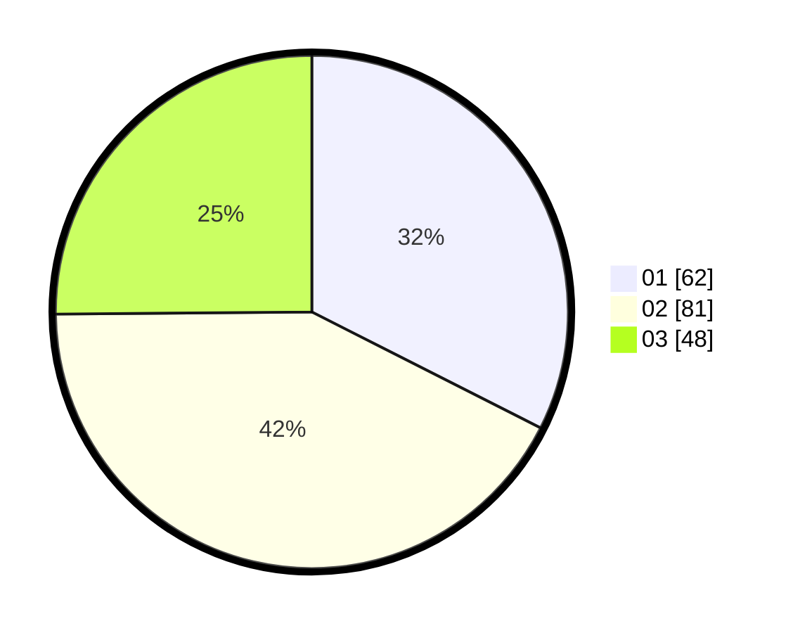

# Hasil

Hasil perolehan suara paslon dapat dilihat pada file paslon-01.txt, paslon-02.txt, dan paslon-03.txt.

Jika tidak ada, artinya data tersebut belum ada pada SIREKAP.

## Perolehan Suara

 * Paslon 01: **62**.
 * Paslon 02: **81**.
 * Paslon 03: **48**.

## Foto C Plano

https://sirekap-obj-formc.kpu.go.id/675d/pemilu/ppwp/31/75/01/10/04/3175011004021-20240215-020739--83ac0ba7-09aa-43a4-a986-34d5a7c836e0.jpg

https://sirekap-obj-formc.kpu.go.id/675d/pemilu/ppwp/31/75/01/10/04/3175011004021-20240215-020354--0f652aa4-e572-4e43-b100-2fda85289851.jpg

https://sirekap-obj-formc.kpu.go.id/675d/pemilu/ppwp/31/75/01/10/04/3175011004021-20240215-020954--c6f8bc6a-d455-41d5-9405-2ffbee47762a.jpg
