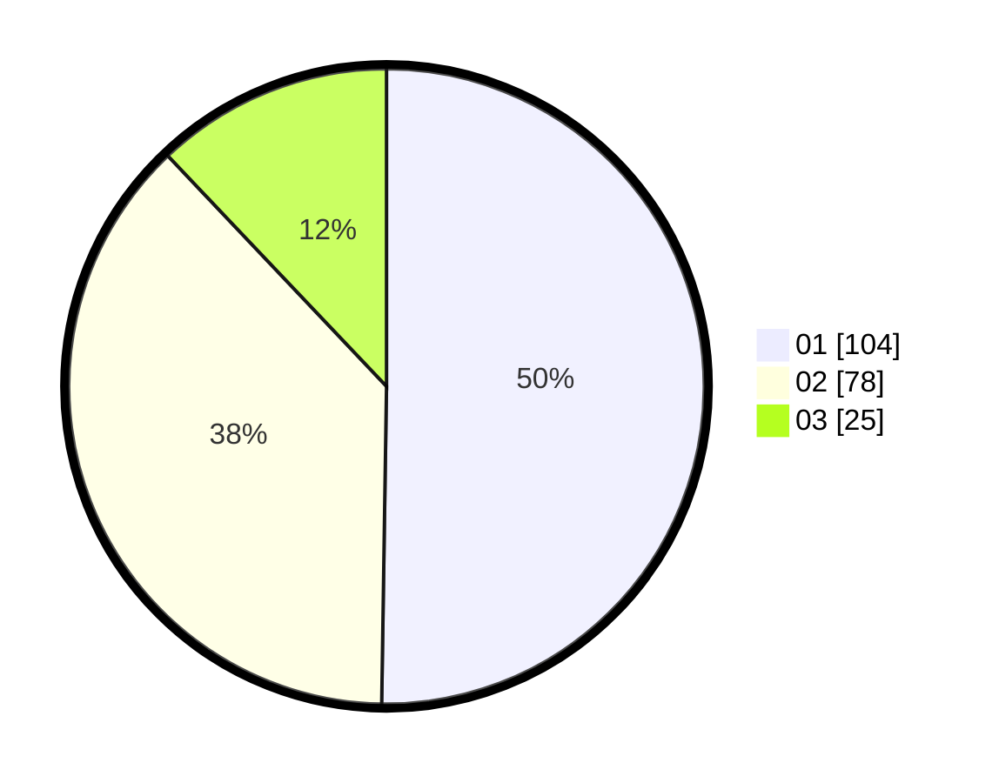

# Hasil

Hasil perolehan suara paslon dapat dilihat pada file paslon-01.txt, paslon-02.txt, dan paslon-03.txt.

Jika tidak ada, artinya data tersebut belum ada pada SIREKAP.

## Perolehan Suara

 * Paslon 01: **104**.
 * Paslon 02: **78**.
 * Paslon 03: **25**.

## Foto C Plano

https://sirekap-obj-formc.kpu.go.id/f5fa/pemilu/ppwp/31/75/01/10/04/3175011004022-20240214-225608--1933970e-599e-4605-812c-ed7bfbdf3969.jpg

https://sirekap-obj-formc.kpu.go.id/f5fa/pemilu/ppwp/31/75/01/10/04/3175011004022-20240214-231346--9787347b-03cc-4547-a575-e5601efae1ed.jpg

https://sirekap-obj-formc.kpu.go.id/f5fa/pemilu/ppwp/31/75/01/10/04/3175011004022-20240214-231445--139722ef-3462-432b-beb9-daad2a8e5d86.jpg
