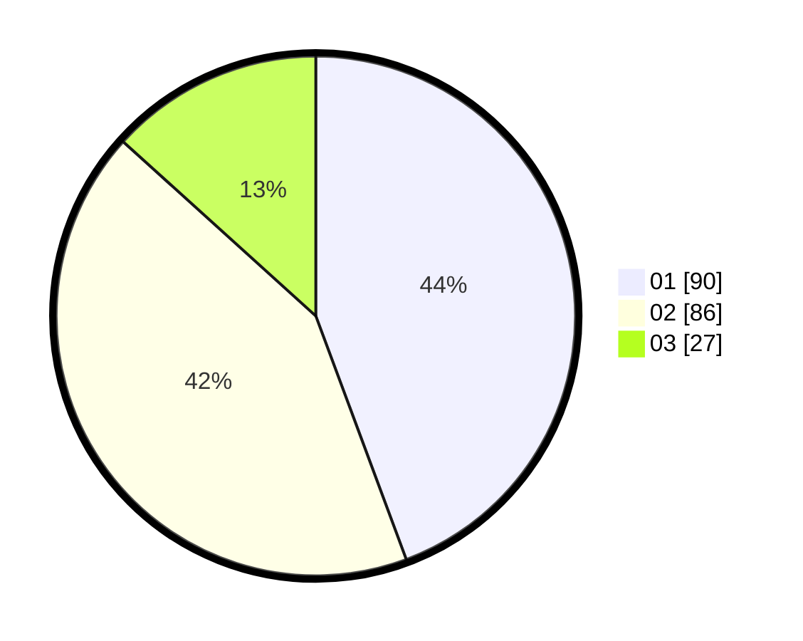

# Hasil

Hasil perolehan suara paslon dapat dilihat pada file paslon-01.txt, paslon-02.txt, dan paslon-03.txt.

Jika tidak ada, artinya data tersebut belum ada pada SIREKAP.

## Perolehan Suara

 * Paslon 01: **90**.
 * Paslon 02: **86**.
 * Paslon 03: **27**.

## Foto C Plano

https://sirekap-obj-formc.kpu.go.id/ae24/pemilu/ppwp/31/75/01/10/04/3175011004023-20240215-043421--8b6ae0d4-5393-4703-8936-8e1e84527b2b.jpg

https://sirekap-obj-formc.kpu.go.id/ae24/pemilu/ppwp/31/75/01/10/04/3175011004023-20240215-043525--6363a040-d6f9-471c-aca2-580e4d24ef1d.jpg

https://sirekap-obj-formc.kpu.go.id/ae24/pemilu/ppwp/31/75/01/10/04/3175011004023-20240215-043610--7b89aec5-4275-4052-971c-c5dc0c3ed8f4.jpg
