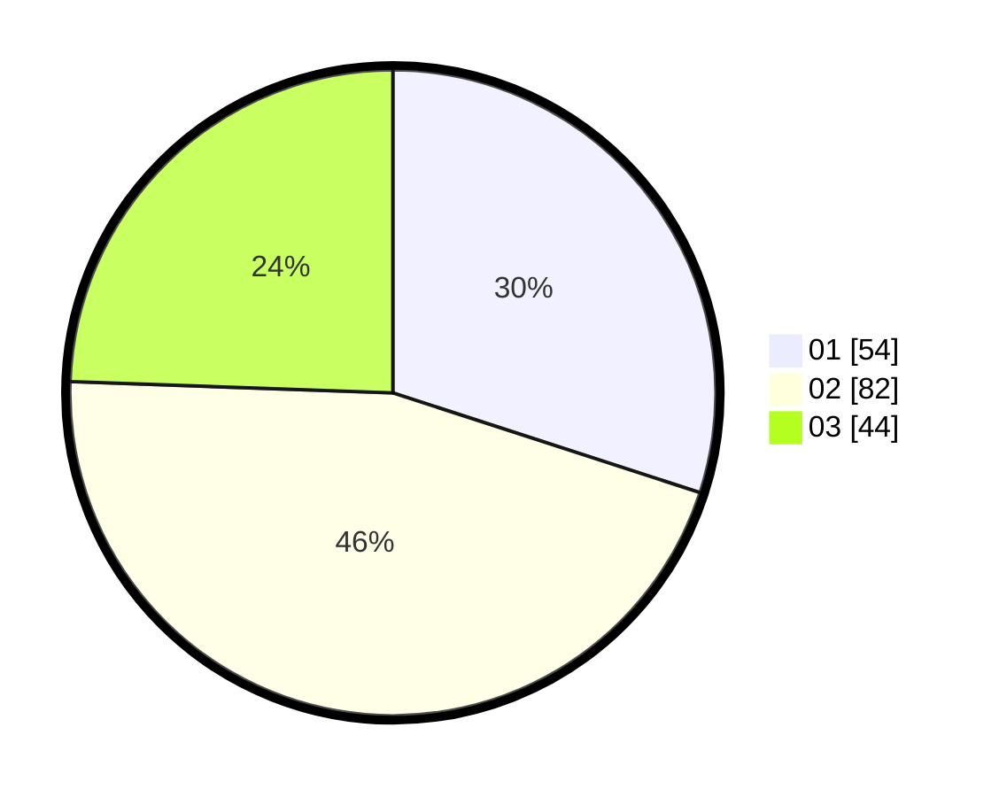

# Hasil

Hasil perolehan suara paslon dapat dilihat pada file paslon-01.txt, paslon-02.txt, dan paslon-03.txt.

Jika tidak ada, artinya data tersebut belum ada pada SIREKAP.

## Perolehan Suara

 * Paslon 01: **54**.
 * Paslon 02: **82**.
 * Paslon 03: **44**.

## Foto C Plano

https://sirekap-obj-formc.kpu.go.id/ca19/pemilu/ppwp/31/75/01/10/04/3175011004024-20240215-002506--3320bd5f-208b-4b3d-bdcb-1cac80903acf.jpg

https://sirekap-obj-formc.kpu.go.id/ca19/pemilu/ppwp/31/75/01/10/04/3175011004024-20240215-002823--0dd56bbf-c551-478d-9095-d8e611fb02db.jpg

https://sirekap-obj-formc.kpu.go.id/ca19/pemilu/ppwp/31/75/01/10/04/3175011004024-20240215-003028--f2aefaa6-df18-45fd-9a02-d7aa003dc54c.jpg
