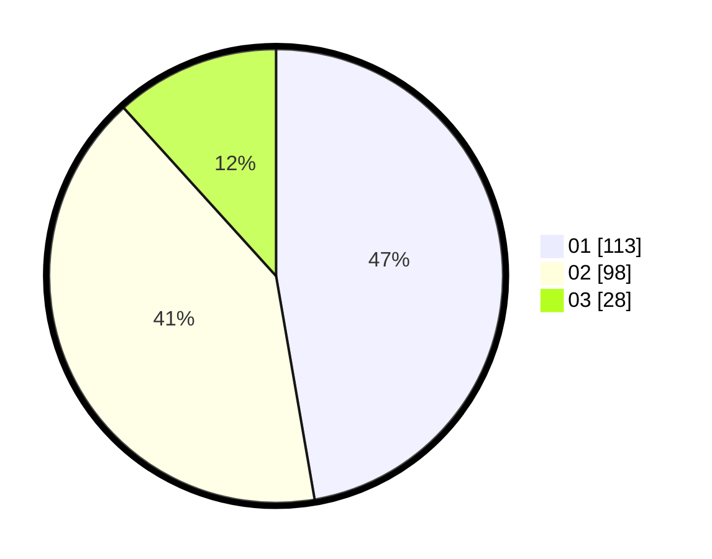

# Hasil

Hasil perolehan suara paslon dapat dilihat pada file paslon-01.txt, paslon-02.txt, dan paslon-03.txt.

Jika tidak ada, artinya data tersebut belum ada pada SIREKAP.

## Perolehan Suara

 * Paslon 01: **113**.
 * Paslon 02: **98**.
 * Paslon 03: **28**.

## Foto C Plano

https://sirekap-obj-formc.kpu.go.id/e061/pemilu/ppwp/31/75/01/10/04/3175011004034-20240215-234353--234b3a6c-51fa-439e-a01e-7617d3d67255.jpg

https://sirekap-obj-formc.kpu.go.id/e061/pemilu/ppwp/31/75/01/10/04/3175011004034-20240214-223012--e448c871-956c-4304-aee2-a98397e9a38f.jpg
